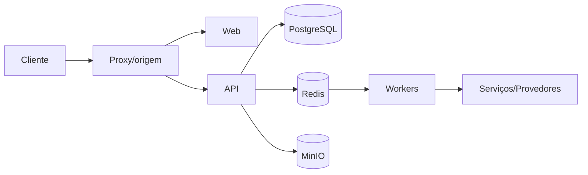

# API externa e MCP — Design

## Estrutura

- O frontend consome uma origem configurável e delega autenticação e autorização à API. **[CONFIRMADO]**
- Serviços internos comunicam-se por rede Docker e nomes de serviço. **[CONFIRMADO]**
- PostgreSQL persiste domínio; Redis coordena cache/filas; MinIO persiste objetos. **[CONFIRMADO]**
- Processos especializados permanecem isolados para permitir evolução e falha parcial. **[CONFIRMADO]**

## Interfaces

- `GET/POST/PATCH /api/v1/companies`. **[CONFIRMADO]**
- `GET/POST/PATCH /api/v1/contacts`. **[CONFIRMADO]**
- `GET/POST/PATCH /api/v1/opportunities`. **[CONFIRMADO]**
- `GET/POST/PATCH /api/v1/tasks`. **[CONFIRMADO]**
- `GET/POST/PATCH /api/v1/tags`. **[CONFIRMADO]**
- `GET/POST/PATCH /api/v1/custom-fields`. **[CONFIRMADO]**
- `GET/POST/PATCH /api/v1/segments`. **[CONFIRMADO]**
- `GET/POST /api/v1/mcp/*`. **[CONFIRMADO]**
- `POST /mcp`. **[CONFIRMADO]**

## Fluxo

**[CONFIRMADO]**

## Decisões

- As fronteiras são configuradas por ambiente para permitir localhost, LAN e produção sem alterar domínio. **[CONFIRMADO]**
- Efeitos demorados ficam fora do request HTTP e usam estado persistente. **[CONFIRMADO]**
- Segurança é aplicada no backend e na rede; controles visuais são apenas apoio. **[CONFIRMADO]**

## Observabilidade e riscos

- Healthchecks devem distinguir dependência obrigatória de recurso opcional. **[INFERIDO]**
- Ausência de CI automatizado aumenta o risco de implantação de build não validado. **[CONFIRMADO]**
- Configuração divergente entre Compose, proxy e .env pode produzir links incorretos ou serviços inacessíveis. **[CONFIRMADO]**

## Referências

`apps/api/src/auth/auth.guard.ts`, `apps/api/src/common/idempotency.interceptor.ts`, `apps/api/src/swagger/public-api-document.ts`, `apps/api/src/mcp/mcp.controller.ts`, `apps/mcp/src/main.ts`, `packages/contracts/src`. **[CONFIRMADO]**
