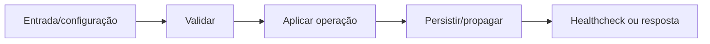

# Servidor MCP — Design

## Fluxo

Cliente MCP → Streamable HTTP → validar ferramenta → chamar API com chave → resposta estruturada **[CONFIRMADO]**

**[INFERIDO]**

## Falhas e segurança

- Falha obrigatória interrompe o fluxo antes de expor estado inconsistente. **[INFERIDO]**
- Valores secretos são redigidos em logs e não entram no frontend. **[CONFIRMADO]**
- Reexecução deve ser segura ou exigir confirmação explícita quando houver efeito externo. **[INFERIDO]**

## Referências

`apps/mcp/src/main.ts`, `apps/api/src/mcp/mcp.controller.ts`. **[CONFIRMADO]**
