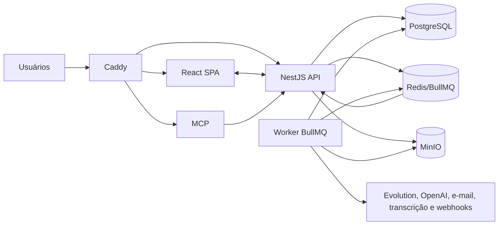
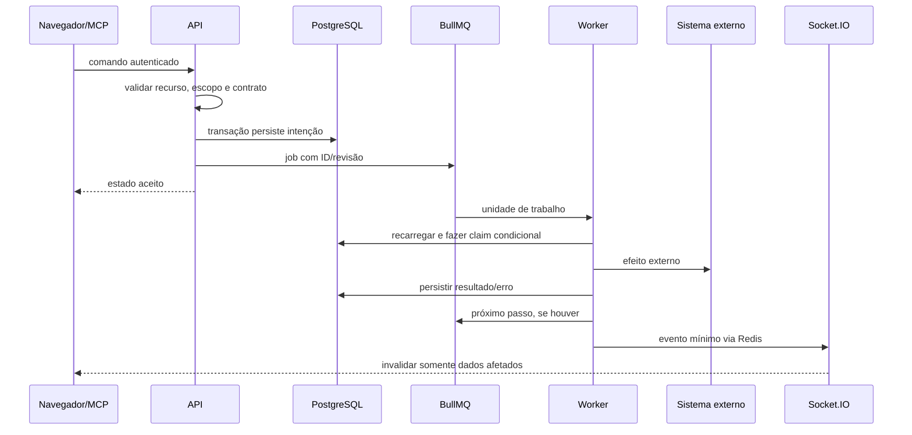

# Arquitetura do BZS One

> Síntese arquitetural retroativa do repositório em 2026-08-21.  
> Escala: 🟢 confirmado; 🟡 inferido; 🔴 lacuna.

## 1. Resumo executivo

O BZS One é um **monorepo TypeScript modular e auto-hospedado**. Uma SPA React conversa com uma API NestJS; operações demoradas são persistidas no PostgreSQL e executadas por um worker BullMQ. Redis coordena filas, locks e Pub/Sub; MinIO guarda arquivos privados; Caddy é a borda. Um processo MCP adapta um subconjunto não destrutivo da API para clientes LLM. 🟢

A arquitetura é um **monólito modular distribuído em quatro processos de aplicação**, não um conjunto de microserviços autônomos: API e worker compartilham o mesmo schema Prisma, contratos e banco; o MCP depende da API; a SPA não acessa dados diretamente. 🟢

## 2. Princípios arquiteturais observados

1. **Persistir antes de executar:** PostgreSQL é a fonte de verdade; a fila carrega IDs e agenda. 🟢
2. **Autorização na borda e no domínio:** guard verifica ação; serviço verifica organização e escopo. 🟢
3. **Integrações fora do navegador:** credenciais e chamadas privilegiadas ficam na API/worker. 🟢
4. **Idempotência por construção:** índices únicos, IDs determinísticos, revisão e updates condicionais. 🟢
5. **Versão imutável para grafos publicados:** workflow/chatbot em execução não muda com o próximo rascunho. 🟢
6. **UI reativa, não autoritativa:** React Query/Socket.IO atualizam visualização; estado canônico fica no backend. 🟢
7. **Isolamento de integração instável:** Evolution tem dados/serviços próprios e o CRM absorve seus webhooks. 🟢
8. **Falha recuperável:** reconciliadores reconstroem jobs a partir do banco. 🟢
9. **Operação humana acima da automação:** assumir conversa interrompe chatbot/IA; propostas de IA exigem aprovação. 🟢

## 3. Estilo e fronteiras

### 3.1 Monorepo e processos

| Unidade | Tipo | Responsabilidade canônica |
|---|---|---|
| `apps/web` | SPA | interação, cache, acessibilidade e navegação |
| `apps/api` | aplicação modular | comandos/consultas, autenticação, transações e publicação de jobs |
| `apps/worker` | daemon assíncrono | efeitos externos, retries, reconciliação e manutenção |
| `apps/mcp` | adaptador stateless | ferramentas LLM sobre REST escopada |
| `packages/contracts` | biblioteca | Zod, DTOs e normalização compartilhada |
| `packages/database` | biblioteca | Prisma Client, schema, migrations e seed |

### 3.2 Bounded contexts práticos

Os 16 módulos descobertos formam contextos funcionais sobre o mesmo banco:

- identidade e acesso;
- CRM e vendas;
- WhatsApp/Inbox;
- campanhas/e-mail;
- workflows;
- chatbots;
- follow-ups;
- IA/conhecimento;
- mídia/transcrição;
- relatórios/webhooks;
- respostas rápidas;
- realtime/notificações;
- API externa/MCP;
- interface web;
- plataforma assíncrona;
- infraestrutura.

As fronteiras são organizacionais no código, não físicas no banco. Relações Prisma atravessam módulos diretamente. 🟢

## 4. Fluxos arquiteturais críticos

### 4.1 Comando síncrono com efeito assíncrono

Aplicações: envio WhatsApp, campanhas, automações, chatbot, follow-up, IA/RAG, transcrição, e-mails e webhooks. 🟢

### 4.2 Inbound WhatsApp

Webhook é persistido idempotentemente e respondido antes do processamento pesado. O worker resolve a instância, normaliza evento/mídia, cria ou atualiza contato/conversa/mensagem, aplica interrupções e publica atualização. Uma conversa fechada volta a `WAITING` sem responsável. 🟢

### 4.3 Follow-up e automação

Follow-up cria tarefa e agendamento na mesma transação. Um job atrasado valida revisão e tolerância; cada mensagem só agenda a seguinte depois do sucesso. Workflows/chatbots fixam versões publicadas e avançam um nó por job/fronteira assíncrona. 🟢

### 4.4 IA e RAG

A API registra a geração, o worker coleta contexto autorizado, aguarda transcrições, chama OpenAI com schema estrito e persiste resultado/métricas/fontes. Documentos RAG passam por armazenamento privado e Vector Store por organização. Assumir a conversa cancela a resposta automática ainda pendente. 🟢

## 5. Modelo de dados

- 63 models Prisma, 25 enums e 35 migrações no snapshot analisado. 🟢
- UUID em chaves primárias; UTC no banco; BRL e `America/Sao_Paulo` na apresentação/operação. 🟢
- `organizationId` é a fronteira lógica dominante.
- Entidades comerciais principais usam `archivedAt`; execuções e mensagens preservam histórico por estado/evento.
- N:N explícitos para contato/empresa, oportunidade/contato, tags, segmentos e equipes/instâncias.
- JSON é usado para grafos, payloads do provedor, custom fields, contexto e resultados estruturados.

O mapa completo está em [`erd-complete.md`](erd-complete.md); semântica de campos em [`data-dictionary.md`](data-dictionary.md).

## 6. Segurança

### 6.1 Controles confirmados

- Hash Argon2id para senha; JWT e sessão persistida por hash.
- CSRF em mutações autenticadas por cookie.
- Rate limit de login/recuperação.
- RBAC recurso/ação e escopos `ALL/TEAM/OWN`.
- Verificação de `organizationId` e visibilidade especial do Inbox.
- Chaves de API armazenadas por SHA-256, expiradas/revogáveis e limitadas a rotas públicas.
- Criptografia de segredos externos; credenciais não são retornadas ao navegador.
- URLs assinadas e prefixo organizacional de mídia.
- Anti-SSRF com resolução DNS repetida, IP público fixado e redirects revalidados.
- Containers principais sem root e redes internas/egress seletivo.

### 6.2 Exceções e lacunas

- Helmet opera com Content Security Policy desativada. 🟢
- Escopo é aplicado nos serviços, sem middleware genérico que prove cobertura de toda rota futura. 🟢
- A ordem de permissões sobrepostas pode mudar o escopo escolhido. 🟡
- Não há pipeline CI/CD versionado para validar segurança em cada push. 🔴
- Não há observabilidade distribuída ou SLOs formais. 🔴

## 7. Integrações externas

| Integração | Direção | Uso | Resiliência / segurança |
|---|---|---|---|
| Evolution API | bidirecional | instâncias, QR, envio, mídia, status | webhook idempotente, retry, reconciliação e isolamento por instância |
| OpenAI | saída | respostas, resumos, embeddings/File Search | fila serial, timeout, schema, retry limitado, chave criptografada |
| Mailgun | bidirecional | transacionais e eventos de entrega | HMAC, dedupe e estado persistido |
| Gmail SMTP | saída | campanhas manuais | TLS, pool 1, classificação de erro SMTP |
| Speaches | saída local | áudio → texto | concorrência baixa, timeout, download único de modelo |
| BrasilAPI | saída | CNPJ | timeout e erro controlado |
| S3/MinIO | saída interna + upload direto | arquivos privados | URLs temporárias, HEAD, ownership e limites |
| Webhooks de clientes | saída | 14 ações comerciais | HMAC, anti-SSRF, timeout, 8 tentativas e dead letter |
| MCP | entrada/saída interna | LLM → API pública | Host/Origin, bearer escopado e ferramentas não destrutivas |

## 8. Desempenho e escalabilidade

### Mecanismos presentes

- Paginação por cursor para contatos, oportunidades e mensagens; Inbox carrega 30 mensagens por página. 🟢
- Contatos carregados de 20 em 20 na interface. 🟢
- Índices B-tree/compostos e GIN trigram nas consultas comerciais e de agenda. 🟢
- Consultas independentes de dashboard/relatório em paralelo. 🟢
- Lazy loading de rotas, imagens e páginas React. 🟢
- Cache React Query e invalidação por evento com coalescência de 100 ms. 🟢
- Concorrências por fila e rate limit de outbound; IA estritamente serial. 🟢
- Reconciliadores consultam índices/limites em vez de varrer toda a base. 🟢

### Limites atuais

- Um único PostgreSQL/Redis/worker atende todos os módulos; escala horizontal do worker exige revisar timers e locks além do sync Evolution. 🟡
- Socket gateway e cache de auth são locais à API; múltiplas réplicas dependeriam de adaptador Socket.IO Redis e invalidação compartilhada completa. 🟡
- A Evolution e a transcrição competem por CPU/RAM na mesma máquina. 🟢
- Grafo e payloads JSON reduzem capacidade de consulta relacional fina. 🟢

## 9. Confiabilidade e recuperação

- Jobs críticos são idempotentes e revalidam o PostgreSQL.
- Reconciliadores cobrem campanhas, waits, follow-ups, IA e RAG.
- Shutdown do worker é gracioso.
- Redis usa AOF; bancos e objetos usam volumes.
- `rebuild.sh` preserva volumes e aplica migrações antes da aplicação.

Porém o backup atual é incompleto: não cifra arquivo, não inclui mídias/sessões Evolution, não implementa retenção semanal nem restauração testada. 🔴

## 10. Testabilidade e qualidade

- 78 arquivos de teste cobrem todos os workspaces e módulos críticos. 🟢
- Vitest, Supertest, typecheck e SonarCloud fazem parte da disciplina local. 🟢
- Não há métrica de cobertura versionada nem gate CI no repositório. 🔴
- Integrações possuem clientes isolados e simuladores/testes unitários, mas homologação real de Evolution/OpenAI/e-mail depende do ambiente. 🟢
- O gráfico mensal de receita ainda contém valores ilustrativos e não deve ser tratado como relatório real. 🟢

## 11. Dívidas técnicas priorizadas

| Prioridade | Dívida | Impacto | Evidência/confiança |
|---|---|---|---|
| P0 | Backup sem criptografia, sem volumes Evolution e sem restore testado | perda de dados e descumprimento da premissa operacional | `scripts/backup.sh` 🟢 |
| P1 | Ausência de CI/CD versionado | mudanças podem chegar sem gates reproduzíveis | inventário 🟢 |
| P1 | Worker sem healthcheck | container “Up” não comprova filas/conexões funcionais | Compose 🟢 |
| P1 | CSP desativada | reduz defesa do navegador contra injeção | `apps/api/src/main.ts` 🟢 |
| P1 | Relatórios não aplicam escopo de maneira uniforme por métrica | usuário pode interpretar `OWN/TEAM` de modo incorreto | `reports.service.ts` 🟢 |
| P2 | Permissão sobreposta depende da primeira ocorrência | papel customizado pode obter escopo inesperado | `data-scope.ts` 🟢 |
| P2 | `SPEACHES_IMAGE=latest-cpu` por padrão | update upstream não controlado | Compose/env 🟢 |
| P2 | Evento `notification.created` ouvido sem produtor explícito | atualização pode depender do polling/evento indireto | Shell/realtime 🟡 |
| P2 | Série mensal de receita parcialmente mockada | relatório visual enganoso | `Reports.tsx` 🟢 |
| P2 | Módulos muito grandes no Inbox/Evolution/processadores | custo de manutenção e regressão | análise de código 🟢 |
| P3 | Eventos/estados livres em alguns modelos | pouca validação referencial e documentação dispersa | schema/serviços 🟢 |
| P3 | Monólito modular compartilha schema diretamente | acoplamento entre contextos e migrations coordenadas | Prisma/imports 🟢 |

## 12. Decisões arquiteturais

As decisões retroativas estão em [`adrs/`](adrs/):

1. monorepo TypeScript auto-hospedado;
2. PostgreSQL + BullMQ/reconciliação;
3. autenticação própria, RBAC e API keys;
4. Evolution isolada/customizada;
5. provedores de e-mail separados;
6. MCP como adaptador da API;
7. follow-ups persistentes ligados a tarefas;
8. OpenAI/RAG substituindo Ollama local;
9. URLs relativas e proxy de borda.

## 13. Mapa documental

| Pergunta | Artefato |
|---|---|
| Quem usa e quais sistemas externos existem? | [`c4-context.md`](c4-context.md) |
| Quais processos/serviços executam? | [`c4-containers.md`](c4-containers.md) |
| Como API, worker, web e MCP se dividem? | [`c4-components.md`](c4-components.md) |
| Quais tabelas e relações existem? | [`erd-complete.md`](erd-complete.md) |
| Quais regras e termos são canônicos? | [`domain.md`](domain.md) |
| Quais transições são válidas? | [`state-machines.md`](state-machines.md) |
| Quem pode fazer o quê? | [`permissions.md`](permissions.md) |
| Que mudança afeta quais partes? | [`traceability/spec-impact-matrix.md`](traceability/spec-impact-matrix.md) |
