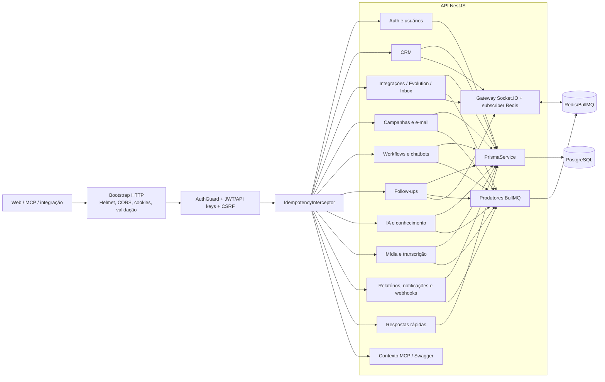
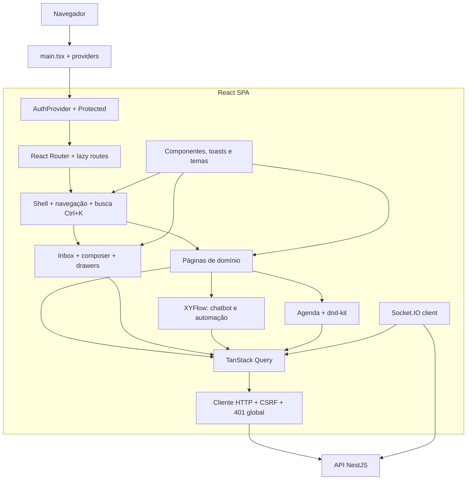
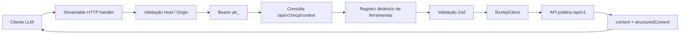
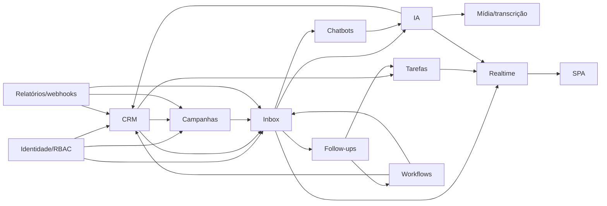

# C4 — Componentes dos containers principais

> Nível 3 reconstruído a partir dos módulos NestJS, processadores do worker, páginas React e adaptador MCP.

## 1. API NestJS

### Responsabilidades e limites

| Componente | Responsabilidade | Não deve fazer |
|---|---|---|
| Guard/interceptor | autenticar, validar permissão e idempotência externa | decidir regra de domínio específica |
| Serviços de domínio | validar escopo, invariantes e transações | executar I/O demorado em request |
| Produtores de fila | publicar IDs/revisões depois de persistir intenção | usar Redis como histórico comercial |
| PrismaService | acesso relacional central | expor client ao frontend/MCP direto |
| Realtime | autenticar socket e invalidar dados afetados | substituir leitura confirmatória da API |

## 2. Worker BullMQ

```mermaid
flowchart TD
  Redis[(Redis / BullMQ)] --> Registry[Bootstrap e registro de 12 workers]

  subgraph Worker[Worker Node.js]
    Inbound[InboundProcessor]
    Outbound[OutboundProcessor]
    Campaign[CampaignProcessor]
    Workflow[WorkflowProcessor]
    Chatbot[ChatbotProcessor]
    Follow[FollowUpProcessor]
    AI[AiGenerationProcessor]
    Knowledge[AiKnowledgeProcessor]
    Audio[AudioTranscriptionProcessor]
    Email[Task digest + transactional e-mail]
    Hooks[ExternalWebhookProcessor]
    Maintenance[MaintenanceProcessor]
    Recon[Timers e reconciliadores]
    Clients[Clientes Evolution, OpenAI, S3, Mailgun, Gmail, transcrição]
    Publish[Publicador realtime Redis]
  end

  Registry --> Inbound
  Registry --> Outbound
  Registry --> Campaign
  Registry --> Workflow
  Registry --> Chatbot
  Registry --> Follow
  Registry --> AI
  Registry --> Knowledge
  Registry --> Audio
  Registry --> Email
  Registry --> Hooks
  Registry --> Maintenance
  Recon --> Campaign
  Recon --> Chatbot
  Recon --> Follow
  Recon --> AI
  Recon --> Knowledge
  Recon --> Maintenance

  Inbound --> Clients
  Outbound --> Clients
  Campaign --> Clients
  AI --> Clients
  Knowledge --> Clients
  Audio --> Clients
  Email --> Clients
  Hooks --> Clients

  Inbound --> DB[(PostgreSQL)]
  Outbound --> DB
  Campaign --> DB
  Workflow --> DB
  Chatbot --> DB
  Follow --> DB
  AI --> DB
  Knowledge --> DB
  Audio --> DB
  Email --> DB
  Hooks --> DB
  Maintenance --> DB

  Inbound --> Publish
  Outbound --> Publish
  Campaign --> Publish
  Workflow --> Publish
  Chatbot --> Publish
  Follow --> Publish
  AI --> Publish
  Knowledge --> Publish
  Audio --> Publish
  Publish --> Redis
```

### Padrão comum de processador

1. Receber job com ID mínimo.
2. Recarregar registro e relações no PostgreSQL.
3. Verificar organização, estado, revisão e idempotência.
4. Executar uma unidade pequena de I/O/negócio.
5. Persistir resultado ou falha antes de relançar.
6. Enfileirar próximo passo quando necessário.
7. Publicar evento mínimo para realtime.

## 3. SPA React

- Rotas são carregadas sob demanda e o menu é filtrado por permissão. 🟢
- Query cache e Socket.IO fazem invalidação seletiva; Inbox pagina mensagens e contatos gradualmente. 🟢
- `apple-ui.css` é a camada final de tokens/movimento sobre os estilos históricos; a ordem de importação é crítica. 🟢

## 4. Servidor MCP

| Componente | Responsabilidade |
|---|---|
| Handler | transporte stateless, autenticação preliminar e erros controlados |
| Contexto | obter organização e escopos efetivos da API |
| Registry | anunciar apenas ferramentas cobertas por escopos |
| Schemas | impedir argumentos fora do contrato |
| API client | aceitar só caminhos relativos, timeout e idempotência |

## 5. Dependências entre componentes de domínio

`async-platform` e infraestrutura são dependências transversais de todos os módulos que produzem trabalho externo. 🟢
