# C4 — Containers

> Nível 2 do BZS One. Todos os containers abaixo são confirmados no Compose ou nos workspaces, exceto relações marcadas como inferidas.

```mermaid
C4Container
  title BZS One — containers e serviços

  Person(user, "Usuário interno", "Administrador, gestor, SDR ou vendedor")
  Person(llm, "Cliente MCP", "LLM autorizada por chave de API")

  System_Boundary(bzs, "BZS One") {
    Container(edge, "Caddy", "Caddy 2.10", "TLS, compressão, headers e roteamento de borda")
    Container(web, "Web SPA", "React 19 + Vite + Nginx", "Interface pt-BR, cache, rotas e Socket.IO")
    Container(api, "API", "NestJS 11 / Node 24", "REST, autenticação, regras, mídia assinada, Swagger e gateway realtime")
    Container(worker, "Worker", "Node 24 + BullMQ", "Mensagens, campanhas, workflows, chatbot, follow-up, IA, e-mail e manutenção")
    Container(mcp, "Servidor MCP", "MCP SDK + Hono / Node 24", "Ferramentas escopadas que adaptam a API pública")
    ContainerDb(db, "PostgreSQL CRM", "PostgreSQL 17", "Fonte de verdade comercial, operacional e auditoria")
    ContainerDb(redis, "Redis CRM", "Redis 7.4 AOF", "BullMQ, locks e Pub/Sub realtime")
    ContainerDb(media, "MinIO CRM", "MinIO / S3", "Mídias, propostas, anexos e documentos RAG")
    Container(transcription, "Transcrição", "Speaches + faster-whisper-small", "Transcrição local CPU/int8")
    Container(evoInit, "Init Evolution", "Alpine", "Ajusta ownership do volume legado e encerra")
    Container(evolution, "Evolution API", "Imagem BZS 2.3.7", "Sessões WhatsApp, QR, mídia e previews")
    ContainerDb(evoDb, "PostgreSQL Evolution", "PostgreSQL 17", "Persistência interna da Evolution")
    ContainerDb(evoRedis, "Redis Evolution", "Redis 7.4", "Cache e filas internas da Evolution")
    ContainerDb(evoMedia, "MinIO Evolution", "MinIO / S3", "Objetos internos da Evolution")
  }

  System_Ext(whatsapp, "WhatsApp", "Rede externa")
  System_Ext(openai, "OpenAI", "Responses API e File Search")
  System_Ext(mailgun, "Mailgun", "E-mail transacional")
  System_Ext(gmail, "Gmail SMTP", "Campanhas manuais")
  System_Ext(brasilapi, "BrasilAPI", "Consulta de CNPJ")
  System_Ext(webhook, "Endpoints externos", "Webhooks GET assinados")

  Rel(user, edge, "Usa", "HTTPS / WSS")
  Rel(llm, edge, "Chama /mcp", "HTTPS + Bearer pk_")
  Rel(edge, web, "Entrega SPA", "HTTP")
  Rel(edge, api, "Encaminha /api, /docs, /socket.io e webhooks", "HTTP / WS")
  Rel(edge, mcp, "Encaminha /mcp", "HTTP")
  Rel(web, api, "REST e realtime", "JSON / Socket.IO")
  Rel(mcp, api, "Executa API pública", "HTTP JSON + Bearer pk_")
  Rel(api, db, "Lê e grava", "Prisma/PostgreSQL")
  Rel(api, redis, "Publica jobs e consome Pub/Sub", "Redis/BullMQ")
  Rel(api, media, "Metadados, HEAD e URLs assinadas", "S3 API")
  Rel(worker, db, "Revalida e grava estados", "Prisma/PostgreSQL")
  Rel(worker, redis, "Consome filas, locks e publica eventos", "Redis/BullMQ")
  Rel(worker, media, "Lê e grava bytes", "S3 API")
  Rel(worker, evolution, "Envia mensagens e consulta mídia/estado", "HTTP interno")
  Rel(worker, transcription, "Solicita transcrição", "HTTP multipart")
  Rel(api, evolution, "Administra instâncias e QR", "HTTP interno")
  Rel(evoInit, evolution, "Prepara volume antes da inicialização", "volume compartilhado")
  Rel(evolution, evoDb, "Persiste", "PostgreSQL")
  Rel(evolution, evoRedis, "Cache/filas", "Redis")
  Rel(evolution, evoMedia, "Objetos", "S3 API")
  Rel(evolution, whatsapp, "Troca mensagens", "Baileys")
  Rel(evolution, api, "Envia eventos", "Webhook HTTP")
  Rel(worker, openai, "Geração e RAG", "HTTPS")
  Rel(worker, mailgun, "E-mails transacionais", "HTTPS")
  Rel(worker, gmail, "Campanhas", "SMTP TLS")
  Rel(api, brasilapi, "CNPJ", "HTTPS")
  Rel(worker, webhook, "Entrega eventos", "HTTPS GET + HMAC")
```

## Redes e exposição

| Rede | Participantes | Propriedade |
|---|---|---|
| `edge` | Caddy | única fronteira HTTP pública padrão |
| `app` | todos os serviços internos necessários | rede interna sem exposição direta |
| `egress` | API, worker, Evolution e transcrição | acesso externo seletivo |

- PostgreSQL, Redis e MinIO do CRM não compartilham dados/credenciais com os equivalentes da Evolution. 🟢
- MinIO CRM e Evolution podem publicar portas apenas em loopback para operação local; a borda entrega a aplicação por caminhos controlados. 🟢
- Em implantação Tailscale, um override pode substituir o Caddy para evitar disputa de 80/443. 🟢

## Persistência

| Container | Volume | Conteúdo |
|---|---|---|
| PostgreSQL CRM | `postgres_data` | schema BZS One |
| Redis CRM | `redis_data` | AOF, filas e locks recuperáveis |
| MinIO CRM | `minio_data` | arquivos privados |
| Evolution | `evolution_instances` | sessões QR/Baileys |
| PostgreSQL Evolution | volume próprio | dados internos Evolution |
| Redis Evolution | volume próprio | cache interno Evolution |
| MinIO Evolution | `evolution_minio_data` | mídia interna Evolution |
| Transcrição | volume de modelos | modelo Whisper baixado |
| Caddy | volumes de dados/configuração | certificados e estado TLS |

## Características operacionais

- API, web e MCP possuem healthcheck; worker não possui probe própria. 🟢
- Serviços da aplicação executam como usuário sem privilégios; init da Evolution roda isolado apenas para corrigir volume. 🟢
- `SPEACHES_IMAGE` permanece configurável e usa `latest-cpu` como padrão, criando risco de deriva. 🟢
