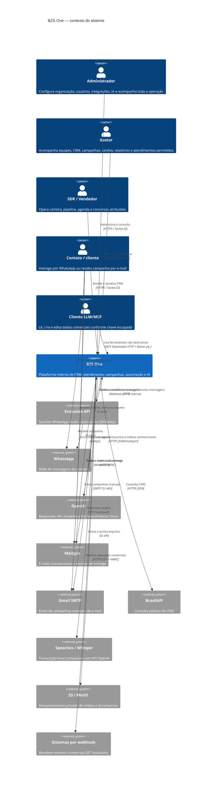

# C4 — Contexto do sistema

> Nível 1 reconstruído em 2026-08-21. 🟢 Relações confirmadas no código/infraestrutura; 🟡 relações operacionais inferidas.

## Fronteira e responsabilidades

- O **BZS One** é responsável pelos dados comerciais, estados de atendimento, autorização, agendamento, filas, auditoria e experiência web. 🟢
- A **Evolution API** mantém a sessão WhatsApp, mas o estado operacional do Inbox e o histórico comercial canônico ficam no BZS One. 🟢
- **OpenAI** recebe somente o contexto selecionado pelo worker; resultados e propostas retornam ao banco do BZS One. 🟢
- **S3/MinIO** guarda bytes; o PostgreSQL guarda propriedade e metadados. 🟢
- Clientes MCP não são confiáveis implicitamente: usam a mesma API escopada e não recebem operações destrutivas. 🟢
- 🔴 O repositório não define SLOs contratuais para os sistemas externos.

## Protocolos expostos

| Superfície | Consumidor | Autenticação | Formato |
|---|---|---|---|
| SPA `/` | usuários internos | cookie/JWT + CSRF | HTML/JS/CSS |
| REST `/api/v1` | SPA e integrações | sessão ou `pk_` conforme rota | JSON, PDF, CSV auxiliar |
| Socket `/realtime` | SPA | cookie de sessão validado | Socket.IO |
| Swagger `/docs` | usuários autorizados/rede publicada | borda + API | OpenAPI/HTML |
| MCP `/mcp` | clientes LLM | Bearer `pk_` | Streamable HTTP |
| `/webhooks/evolution` | Evolution | segredo do webhook | JSON |
| `/webhooks/mailgun` | Mailgun | assinatura HMAC | form/JSON do provedor |
