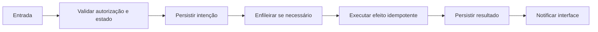

# Ciclo da campanha — Design

## Fluxo

DRAFT → SCHEDULED/RUNNING → PAUSED ↔ RUNNING → COMPLETED/CANCELLED/FAILED **[CONFIRMADO]**

**[INFERIDO]**

## Falhas e retomada

- Entrada inválida falha antes da escrita. **[CONFIRMADO]**
- Falha externa conserva o motivo e segue a política delimitada de retry. **[CONFIRMADO]**
- Reinício retoma pelo estado persistido, não pela memória do processo. **[CONFIRMADO]**
- Estado terminal impede sucessores ou efeitos atrasados indevidos. **[INFERIDO]**

## Observabilidade

- Logs técnicos usam IDs correlacionáveis e não incluem credenciais. **[INFERIDO]**
- Eventos internos explicam transições relevantes ao operador. **[CONFIRMADO]**

## Referências

`apps/api/src/campaigns/campaigns.service.ts`, `apps/worker/src/campaign.processor.ts`. **[CONFIRMADO]**
