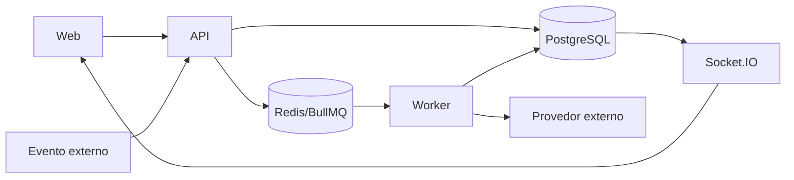

# Campanhas de WhatsApp e e-mail — Design

## Componentes

- Controllers NestJS recebem entradas, aplicam guards e delegam ao serviço de domínio. **[CONFIRMADO]**
- Serviços persistem intenção e estado no PostgreSQL antes de efeitos externos relevantes. **[CONFIRMADO]**
- Workers BullMQ executam integrações, esperas e retentativas em segundo plano. **[CONFIRMADO]**
- A interface React consulta detalhes sob demanda e reage a eventos Socket.IO. **[CONFIRMADO]**

## Interfaces

- `GET/POST /api/v1/campaigns`. **[CONFIRMADO]**
- `GET/PATCH/DELETE /api/v1/campaigns/:id`. **[CONFIRMADO]**
- `POST /api/v1/campaigns/:id/start`. **[CONFIRMADO]**
- `POST /api/v1/campaigns/:id/pause`. **[CONFIRMADO]**
- `POST /api/v1/campaigns/:id/resume`. **[CONFIRMADO]**
- `POST /api/v1/campaigns/:id/cancel`. **[CONFIRMADO]**
- `GET /api/v1/campaigns/:id/invalid-contacts.csv`. **[CONFIRMADO]**

## Fluxo de contêineres

**[INFERIDO]**

## Consistência

- Jobs usam identificadores determinísticos ou chaves naturais para tolerar redelivery. **[CONFIRMADO]**
- O worker revalida estado e versão no banco antes de executar um efeito. **[CONFIRMADO]**
- Transições terminais impedem que jobs antigos reabram processamento concluído. **[INFERIDO]**

## Observabilidade e riscos

- Eventos internos e estados de entrega permitem explicar início, progresso, falha e conclusão. **[CONFIRMADO]**
- Indisponibilidade de provedor deve degradar o recurso, não derrubar o CRM. **[INFERIDO]**
- Segredos são lidos no servidor e nunca incluídos nos eventos enviados ao navegador. **[CONFIRMADO]**
- Retentativa mal delimitada pode duplicar efeito externo; os testes devem simular redelivery e reinício. **[INFERIDO]**

## Referências

`apps/api/src/campaigns/campaigns.controller.ts`, `apps/api/src/campaigns/campaigns.service.ts`, `apps/worker/src/campaign.processor.ts`, `apps/worker/src/gmail-campaign-client.ts`, `apps/web/src/pages/Campaigns.tsx`, `packages/database/prisma/schema.prisma`. **[CONFIRMADO]**
