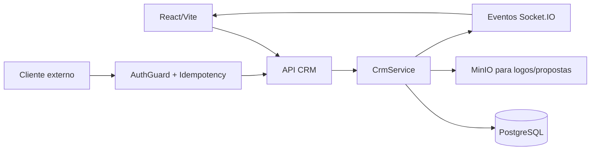

# CRM e vendas — Design

## Componentes

- `CrmController` expõe operações internas e públicas selecionadas sob o prefixo global. **[CONFIRMADO]**
- `CrmService` concentra autorização por escopo, normalização, deduplicação e transações do domínio comercial. **[CONFIRMADO]**
- A interface separa empresas, contatos, pipeline e agenda, reutilizando drawers e modais para edição contextual. **[CONFIRMADO]**
- PostgreSQL é a fonte de verdade; atividades e auditoria preservam mudanças relevantes. **[CONFIRMADO]**

## Interfaces principais

- `GET/POST /api/v1/companies`. **[CONFIRMADO]**
- `GET/PATCH/DELETE /api/v1/companies/:id`. **[CONFIRMADO]**
- `GET/POST /api/v1/contacts`. **[CONFIRMADO]**
- `GET/PATCH/DELETE /api/v1/contacts/:id`. **[CONFIRMADO]**
- `GET/POST /api/v1/opportunities`. **[CONFIRMADO]**
- `GET/PATCH/DELETE /api/v1/opportunities/:id`. **[CONFIRMADO]**
- `GET /api/v1/pipelines`. **[CONFIRMADO]**
- `GET/POST/PATCH/DELETE /api/v1/tasks`. **[CONFIRMADO]**
- `GET/POST /api/v1/tags`. **[CONFIRMADO]**
- `GET/POST /api/v1/custom-fields`. **[CONFIRMADO]**
- `GET/POST /api/v1/segments`. **[CONFIRMADO]**

## Fluxo arquitetural

**[CONFIRMADO]**

## Decisões

- A deduplicação ocorre no serviço e é reforçada por índices onde a representação normalizada permite. **[CONFIRMADO]**
- Cursores substituem offset nas listagens volumosas para manter estabilidade durante inserções. **[CONFIRMADO]**
- O Kanban persiste primeiro na API e usa atualização visual responsiva sem tratar a posição do mouse como estado definitivo. **[INFERIDO]**
- Ativos de logo e proposta armazenam chave segura; URLs assinadas são criadas somente para visualização. **[CONFIRMADO]**

## Observabilidade e riscos

- Importações devem expor totais válidos, inválidos, duplicados e erros por linha. **[CONFIRMADO]**
- Consultas sem índice adequado em campos personalizados podem degradar com cinquenta mil contatos. **[INFERIDO]**
- Mesclagem incompleta pode deixar associações órfãs; por isso precisa de transação e teste de todas as relações. **[INFERIDO]**
- A consulta automática de CNPJ e logo depende de serviços externos e deve permitir edição manual quando indisponível. **[CONFIRMADO]**

## Referências

`apps/api/src/crm/crm.controller.ts`, `apps/api/src/crm/crm.service.ts`, `apps/web/src/pages/Companies.tsx`, `apps/web/src/pages/Contacts.tsx`, `apps/web/src/pages/Pipeline.tsx`, `apps/web/src/pages/Tasks.tsx`, `packages/database/prisma/schema.prisma`. **[CONFIRMADO]**
