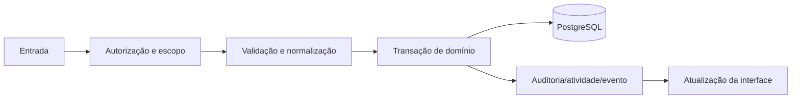

# Tarefas e agenda — Design

## Fluxo

Criar/arrastar tarefa → validar responsável e horário → persistir → atualizar calendário → notificar ou agendar trabalho **[CONFIRMADO]**

**[INFERIDO]**

## Falhas e consistência

- Validação falha antes de qualquer escrita quando a entrada é inválida. **[CONFIRMADO]**
- Operações que alteram múltiplas relações devem ser atômicas. **[INFERIDO]**
- A interface deve reverter estado otimista se a API negar a operação. **[INFERIDO]**
- Dependências externas não podem impedir edição manual dos dados comerciais. **[INFERIDO]**

## Observabilidade

- O ator, o registro e a alteração relevante devem ser rastreáveis. **[CONFIRMADO]**
- Erros de importação ou processamento em lote devem indicar o item afetado. **[CONFIRMADO]**

## Referências

`apps/api/src/crm/crm.controller.ts`, `apps/api/src/crm/crm.service.ts`, `apps/web/src/pages/Tasks.tsx`, `apps/worker/src/task-digest.processor.ts`. **[CONFIRMADO]**
