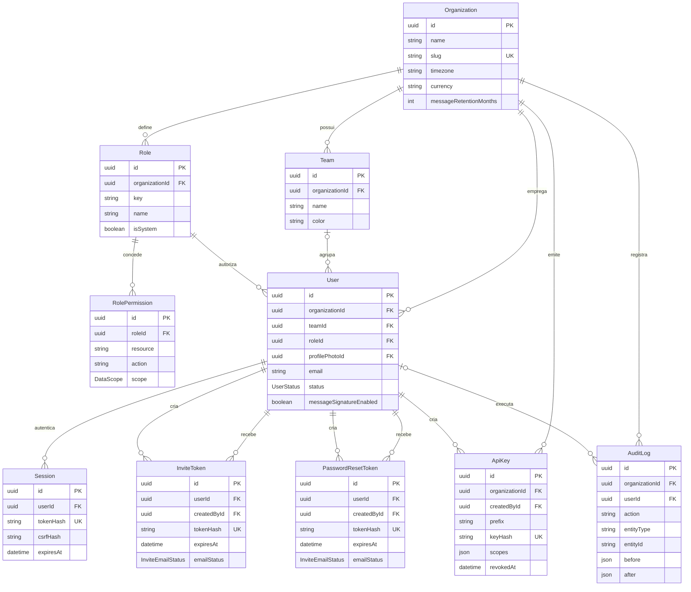
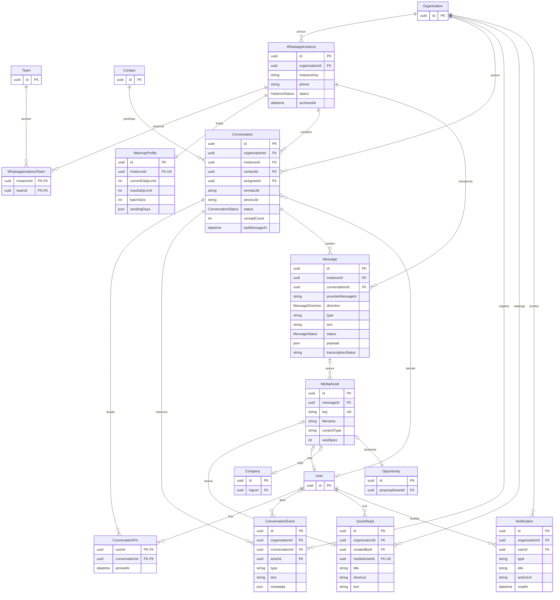
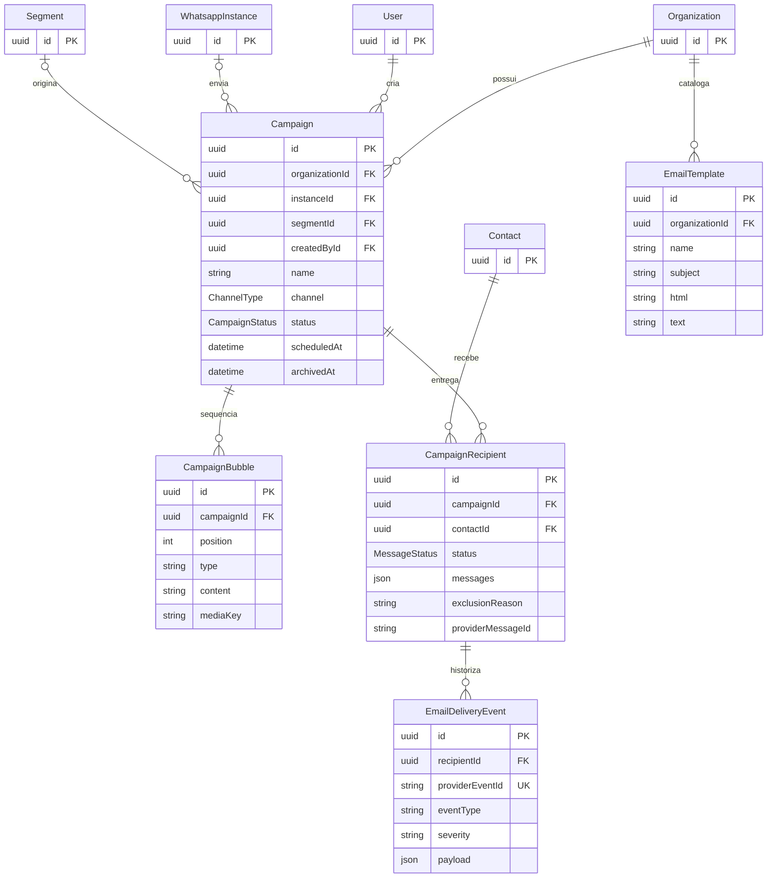
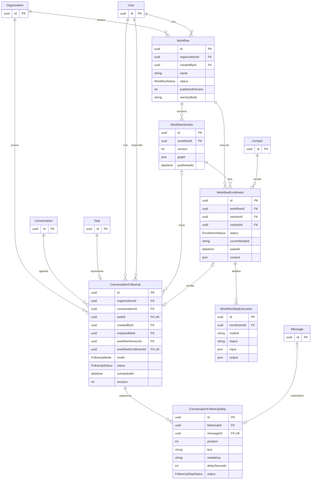
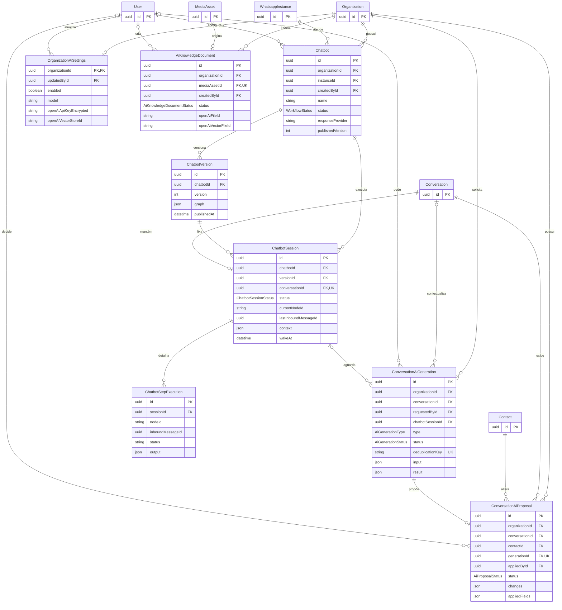
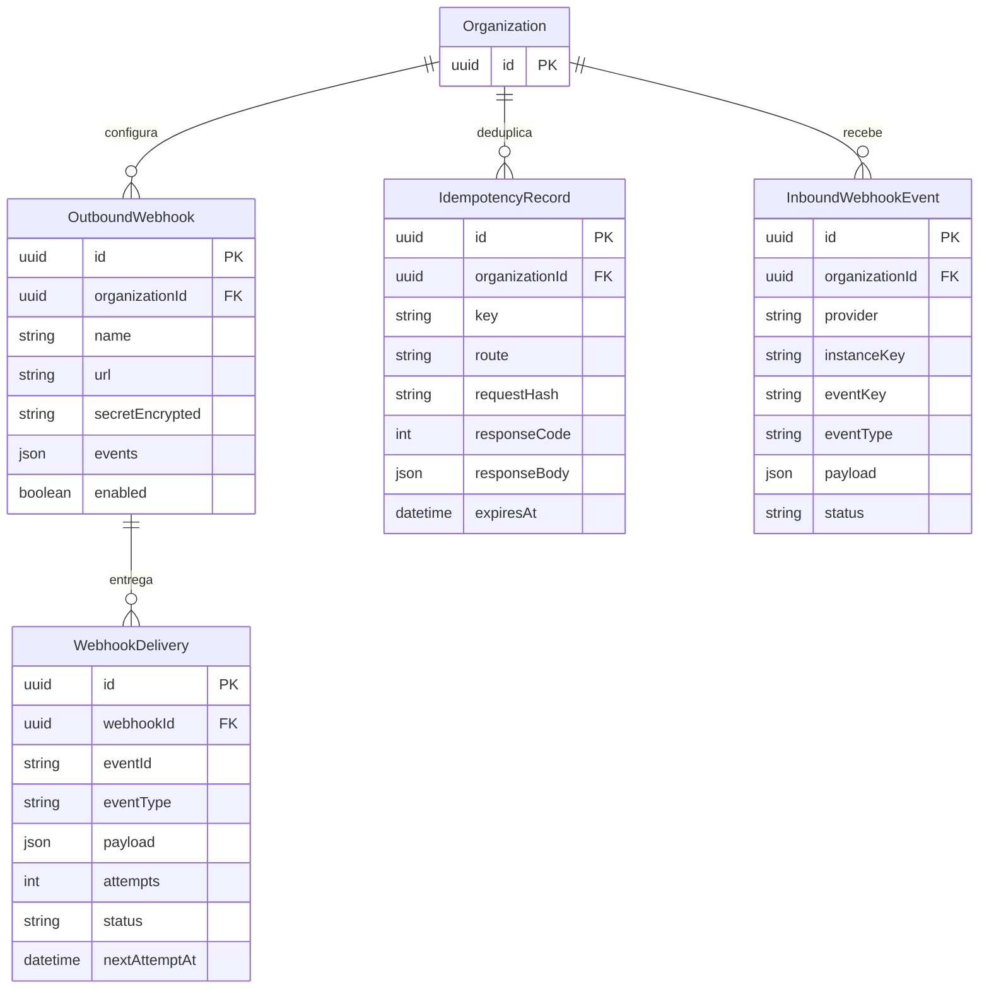

# ERD completo — BZS One

> As 63 entidades Prisma foram divididas em sete diagramas para preservar legibilidade. Campos mostrados são chaves e atributos arquiteturalmente relevantes; o dicionário completo por campo permanece em `schema.prisma` e [`data-dictionary.md`](data-dictionary.md). Todas as relações são 🟢 confirmadas.

## 1. Organização, identidade e acesso

## 2. CRM comercial, agenda e segmentação

```mermaid
erDiagram
  Organization { uuid id PK }
  Team { uuid id PK }
  User { uuid id PK }
  Company {
    uuid id PK
    uuid organizationId FK
    uuid teamId FK
    uuid ownerId FK
    uuid logoId FK
    string name
    string cnpj
    string domain
    string externalId
    datetime archivedAt
  }
  Contact {
    uuid id PK
    uuid organizationId FK
    uuid teamId FK
    uuid ownerId FK
    uuid primaryCompanyId FK
    string name
    string email
    string phone
    string phoneKey
    ConsentStatus consentStatus
    boolean campaignsBlocked
    datetime archivedAt
  }
  ContactCompany {
    uuid contactId PK,FK
    uuid companyId PK,FK
    boolean isPrimary
  }
  Pipeline {
    uuid id PK
    uuid organizationId FK
    string name
    boolean isActive
  }
  PipelineStage {
    uuid id PK
    uuid pipelineId FK
    string name
    int position
    int probability
    boolean isWon
    boolean isLost
  }
  Opportunity {
    uuid id PK
    uuid organizationId FK
    uuid pipelineId FK
    uuid stageId FK
    uuid companyId FK
    uuid teamId FK
    uuid ownerId FK
    uuid proposalAssetId FK
    string title
    OpportunityStatus status
    int valueCents
    datetime archivedAt
  }
  OpportunityContact {
    uuid opportunityId PK,FK
    uuid contactId PK,FK
    boolean isPrimary
  }
  Task {
    uuid id PK
    uuid organizationId FK
    uuid teamId FK
    uuid assigneeId FK
    uuid createdById FK
    uuid companyId FK
    uuid contactId FK
    uuid opportunityId FK
    string title
    datetime dueAt
    TaskStatus status
    TaskPriority priority
  }
  TaskDigestDelivery {
    uuid id PK
    uuid organizationId FK
    uuid userId FK
    date digestDate
    TaskDigestStatus status
    string providerMessageId
  }
  Note {
    uuid id PK
    uuid authorId FK
    uuid companyId FK
    uuid contactId FK
    uuid opportunityId FK
    string body
  }
  Activity {
    uuid id PK
    uuid organizationId FK
    uuid userId FK
    uuid companyId FK
    uuid contactId FK
    uuid opportunityId FK
    string type
    datetime occurredAt
  }
  Tag {
    uuid id PK
    uuid organizationId FK
    string name
    string color
  }
  CompanyTag { uuid companyId PK,FK uuid tagId PK,FK }
  ContactTag { uuid contactId PK,FK uuid tagId PK,FK }
  OpportunityTag { uuid opportunityId PK,FK uuid tagId PK,FK }
  CustomFieldDefinition {
    uuid id PK
    uuid organizationId FK
    string entity
    string key
    string type
    boolean required
  }
  Segment {
    uuid id PK
    uuid organizationId FK
    string name
    json filters
    boolean isDynamic
  }
  SegmentMember { uuid segmentId PK,FK uuid contactId PK,FK }
  ConsentEvent {
    uuid id PK
    uuid contactId FK
    ConsentStatus status
    string source
    datetime createdAt
  }
  Suppression {
    uuid id PK
    uuid contactId FK
    ChannelType channel
    string reason
  }

  Organization ||--o{ Company : possui
  Organization ||--o{ Contact : possui
  Team o|--o{ Company : classifica
  Team o|--o{ Contact : classifica
  User o|--o{ Company : possui
  User o|--o{ Contact : possui
  Company ||--o{ ContactCompany : vincula
  Contact ||--o{ ContactCompany : vincula
  Company o|--o{ Contact : principal
  Organization ||--o{ Pipeline : configura
  Pipeline ||--o{ PipelineStage : ordena
  Pipeline ||--o{ Opportunity : recebe
  PipelineStage ||--o{ Opportunity : posiciona
  Company o|--o{ Opportunity : gera
  Team o|--o{ Opportunity : classifica
  User o|--o{ Opportunity : possui
  Opportunity ||--o{ OpportunityContact : inclui
  Contact ||--o{ OpportunityContact : participa
  Organization ||--o{ Task : agenda
  Team o|--o{ Task : classifica
  User o|--o{ Task : recebe
  User ||--o{ Task : cria
  Company o|--o{ Task : contextualiza
  Contact o|--o{ Task : contextualiza
  Opportunity o|--o{ Task : contextualiza
  Organization ||--o{ TaskDigestDelivery : controla
  User ||--o{ TaskDigestDelivery : recebe
  User ||--o{ Note : escreve
  Company o|--o{ Note : possui
  Contact o|--o{ Note : possui
  Opportunity o|--o{ Note : possui
  Organization ||--o{ Activity : registra
  User o|--o{ Activity : executa
  Company o|--o{ Activity : recebe
  Contact o|--o{ Activity : recebe
  Opportunity o|--o{ Activity : recebe
  Organization ||--o{ Tag : define
  Company ||--o{ CompanyTag : marca
  Contact ||--o{ ContactTag : marca
  Opportunity ||--o{ OpportunityTag : marca
  Tag ||--o{ CompanyTag : aplica
  Tag ||--o{ ContactTag : aplica
  Tag ||--o{ OpportunityTag : aplica
  Organization ||--o{ CustomFieldDefinition : define
  Organization ||--o{ Segment : define
  Segment ||--o{ SegmentMember : materializa
  Contact ||--o{ SegmentMember : integra
  Contact ||--o{ ConsentEvent : historiza
  Contact ||--o{ Suppression : bloqueia
```

## 3. WhatsApp, Inbox, mídia e notificações

## 4. Campanhas e e-mail

## 5. Workflows, execuções e follow-ups

## 6. Chatbots, IA e conhecimento

## 7. Integração, idempotência e webhooks

## 8. Restrições estruturais de destaque

| Entidade/combinação | Restrição |
|---|---|
| `Role` | chave única por organização |
| `RolePermission` | papel + recurso + ação únicos |
| `User` | e-mail único por organização |
| `Company`/`Contact`/`Opportunity` | `externalId` único por organização quando presente |
| `Contact` | `phoneKey` único por organização quando ativo |
| `PipelineStage` | posição única por funil |
| `Conversation` | JID remoto e telefônico únicos por instância |
| `Message` | `providerMessageId` único por instância |
| `InboundWebhookEvent` | provedor + instância + chave de evento únicos |
| `CampaignRecipient` | campanha + contato únicos |
| `WorkflowVersion`/`ChatbotVersion` | número único por definição |
| `ChatbotSession` | uma sessão persistida por conversa |
| `ConversationFollowUp` | tarefa e inscrição resultante únicas; índice parcial limita um ativo por conversa |
| `ConversationFollowUpStep` | posição única por follow-up; mensagem no máximo em uma etapa |
| `ConversationAiGeneration` | chave de deduplicação global única |
| `ConversationAiProposal` | no máximo uma proposta por geração |
| `AiKnowledgeDocument` | um documento por ativo de mídia |
| `WebhookDelivery` | webhook + evento únicos |
| `IdempotencyRecord` | organização + chave + rota únicas durante retenção |

## 9. Contagem de cobertura

- **Entidades Prisma no schema:** 63.
- **Entidades representadas nos diagramas:** 63.
- **Entidades efêmeras não Prisma:** jobs BullMQ, envelopes Redis/Socket.IO, contratos MCP e resultados calculados; documentadas em [`data-dictionary.md`](data-dictionary.md), não no ERD persistente.
