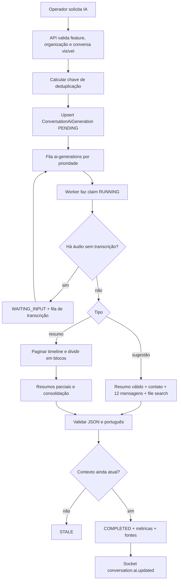
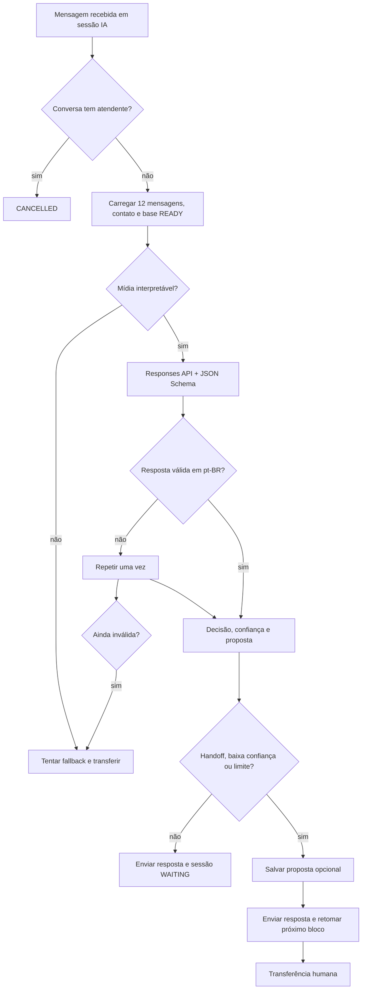
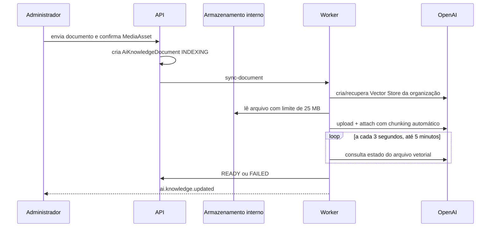

# Fluxos — Inteligência artificial e RAG

## Sugestão ou resumo manual

```mermaid
flowchart TD
  A[Operador solicita IA] --> B[API valida feature, organização e conversa visível]
  B --> C[Calcular chave de deduplicação]
  C --> D[Upsert ConversationAiGeneration PENDING]
  D --> E[Fila ai-generations por prioridade]
  E --> F[Worker faz claim RUNNING]
  F --> G{Há áudio sem transcrição?}
  G -- sim --> H[WAITING_INPUT + fila de transcrição]
  H --> E
  G -- não --> I{Tipo}
  I -- sugestão --> J[Resumo válido + contato + 12 mensagens + file search]
  I -- resumo --> K[Paginar timeline e dividir em blocos]
  K --> L[Resumos parciais e consolidação]
  J --> M[Validar JSON e português]
  L --> M
  M --> N{Contexto ainda atual?}
  N -- não --> O[STALE]
  N -- sim --> P[COMPLETED + métricas + fontes]
  P --> Q[Socket conversation.ai.updated]
```

## Pré-atendimento OpenAI

```mermaid
flowchart TD
  A[Mensagem recebida em sessão IA] --> B{Conversa tem atendente?}
  B -- sim --> C[CANCELLED]
  B -- não --> D[Carregar 12 mensagens, contato e base READY]
  D --> E{Mídia interpretável?}
  E -- não --> F[Tentar fallback e transferir]
  E -- sim --> G[Responses API + JSON Schema]
  G --> H{Resposta válida em pt-BR?}
  H -- não --> I[Repetir uma vez]
  I --> J{Ainda inválida?}
  J -- sim --> F
  H -- sim --> K[Decisão, confiança e proposta]
  I --> K
  K --> L{Handoff, baixa confiança ou limite?}
  L -- não --> M[Enviar resposta e sessão WAITING]
  L -- sim --> N[Salvar proposta opcional]
  N --> O[Enviar resposta e retomar próximo bloco]
  O --> P[Transferência humana]
```

## Indexação da base de conhecimento

```mermaid
sequenceDiagram
  participant U as Administrador
  participant API
  participant S as Armazenamento interno
  participant W as Worker
  participant O as OpenAI
  U->>API: envia documento e confirma MediaAsset
  API->>API: cria AiKnowledgeDocument INDEXING
  API->>W: sync-document
  W->>O: cria/recupera Vector Store da organização
  W->>S: lê arquivo com limite de 25 MB
  W->>O: upload + attach com chunking automático
  loop a cada 3 segundos, até 5 minutos
    W->>O: consulta estado do arquivo vetorial
  end
  W->>API: READY ou FAILED
  W-->>U: ai.knowledge.updated
```
