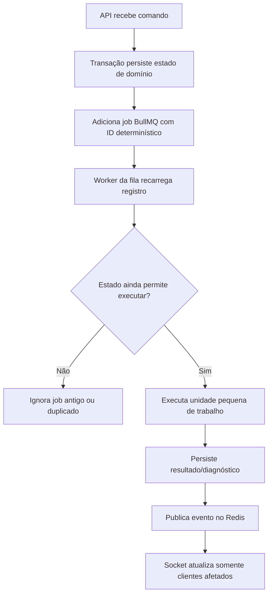
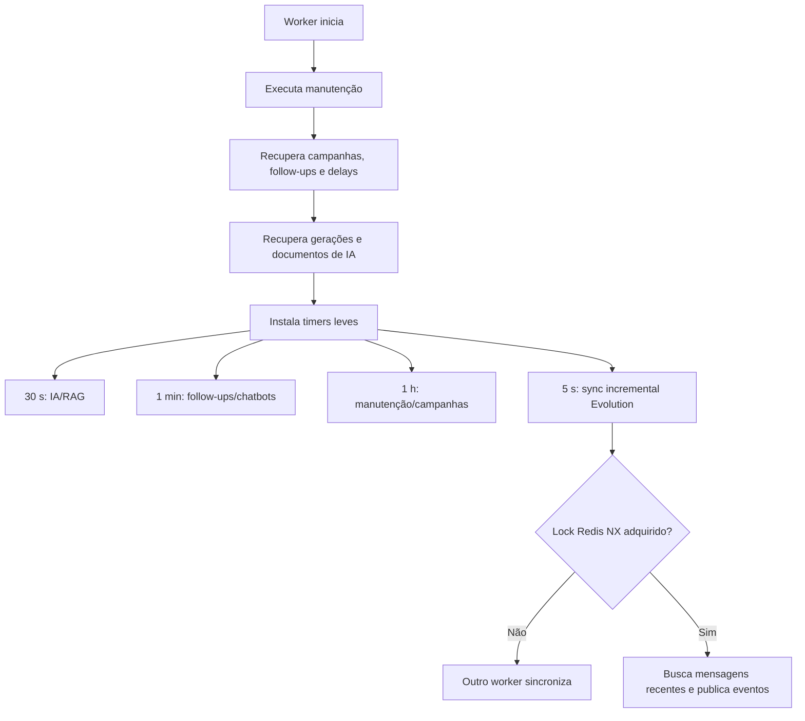
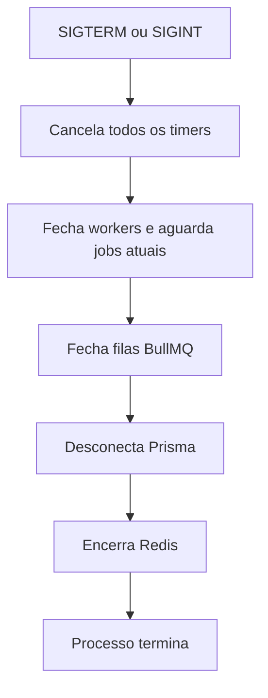

# Fluxos — Plataforma assíncrona

Escala: 🟢 confirmado pelo código | 🟡 inferido | 🔴 lacuna.

## Comando persistente e execução

```mermaid
flowchart TD
    A[API recebe comando] --> B[Transação persiste estado de domínio]
    B --> C[Adiciona job BullMQ com ID determinístico]
    C --> D[Worker da fila recarrega registro]
    D --> E{Estado ainda permite executar?}
    E -- Não --> F[Ignora job antigo ou duplicado]
    E -- Sim --> G[Executa unidade pequena de trabalho]
    G --> H[Persiste resultado/diagnóstico]
    H --> I[Publica evento no Redis]
    I --> J[Socket atualiza somente clientes afetados]
```

## Inicialização e reconciliação

```mermaid
flowchart TD
    A[Worker inicia] --> B[Executa manutenção]
    B --> C[Recupera campanhas, follow-ups e delays]
    C --> D[Recupera gerações e documentos de IA]
    D --> E[Instala timers leves]
    E --> F[30 s: IA/RAG]
    E --> G[1 min: follow-ups/chatbots]
    E --> H[1 h: manutenção/campanhas]
    E --> I[5 s: sync incremental Evolution]
    I --> J{Lock Redis NX adquirido?}
    J -- Não --> K[Outro worker sincroniza]
    J -- Sim --> L[Busca mensagens recentes e publica eventos]
```

## Encerramento gracioso

```mermaid
flowchart TD
    A[SIGTERM ou SIGINT] --> B[Cancela todos os timers]
    B --> C[Fecha workers e aguarda jobs atuais]
    C --> D[Fecha filas BullMQ]
    D --> E[Desconecta Prisma]
    E --> F[Encerra Redis]
    F --> G[Processo termina]
```

