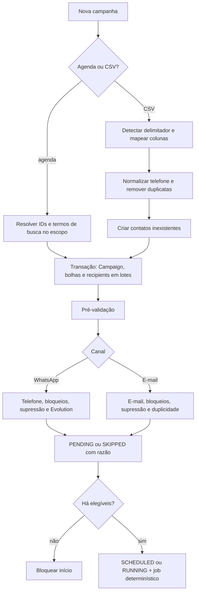
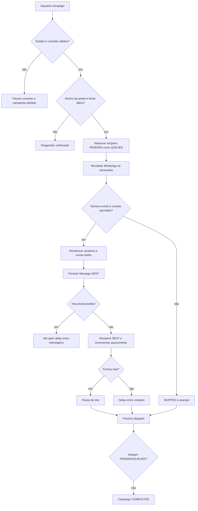
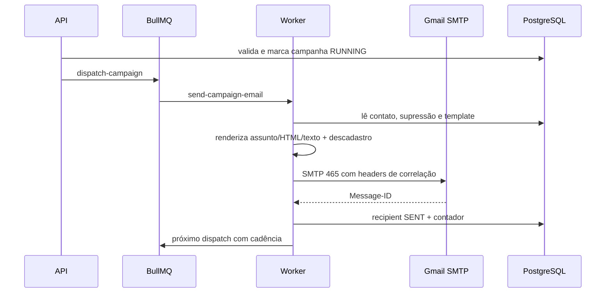

# Fluxos — Campanhas e e-mail

## Criação e pré-validação

```mermaid
flowchart TD
  A[Nova campanha] --> B{Agenda ou CSV?}
  B -- agenda --> C[Resolver IDs e termos de busca no escopo]
  B -- CSV --> D[Detectar delimitador e mapear colunas]
  D --> E[Normalizar telefone e remover duplicatas]
  E --> F[Criar contatos inexistentes]
  C --> G[Transação: Campaign, bolhas e recipients em lotes]
  F --> G
  G --> H[Pré-validação]
  H --> I{Canal}
  I -- WhatsApp --> J[Telefone, bloqueios, supressão e Evolution]
  I -- E-mail --> K[E-mail, bloqueios, supressão e duplicidade]
  J --> L[PENDING ou SKIPPED com razão]
  K --> L
  L --> M{Há elegíveis?}
  M -- não --> N[Bloquear início]
  M -- sim --> O[SCHEDULED ou RUNNING + job determinístico]
```

## Cadência de WhatsApp

```mermaid
flowchart TD
  A[dispatch-campaign] --> B{Estado e conexão válidos?}
  B -- não --> C[Pausar somente a campanha afetada]
  B -- sim --> D{Dentro da janela e limite diário?}
  D -- não --> E[Reagendar verificação]
  D -- sim --> F[Reservar recipient PENDING como QUEUED]
  F --> G[Revalidar WhatsApp se necessário]
  G --> H{Número existe e contato permitido?}
  H -- não --> I[SKIPPED e avançar]
  H -- sim --> J[Renderizar variáveis e enviar bolha]
  J --> K[Persistir Message SENT]
  K --> L{Há próxima bolha?}
  L -- sim --> M[Job após delay entre mensagens]
  L -- não --> N[Recipient SENT e incrementar aquecimento]
  N --> O{Fechou lote?}
  O -- sim --> P[Pausa de lote]
  O -- não --> Q[Delay entre contatos]
  P --> R[Próximo dispatch]
  Q --> R
  I --> R
  R --> S{Restam PENDING/QUEUED?}
  S -- não --> T[Campaign COMPLETED]
```

## Campanha de e-mail

```mermaid
sequenceDiagram
  participant API
  participant Queue as BullMQ
  participant Worker
  participant Gmail as Gmail SMTP
  participant DB as PostgreSQL
  API->>DB: valida e marca campanha RUNNING
  API->>Queue: dispatch-campaign
  Queue->>Worker: send-campaign-email
  Worker->>DB: lê contato, supressão e template
  Worker->>Worker: renderiza assunto/HTML/texto + descadastro
  Worker->>Gmail: SMTP 465 com headers de correlação
  Gmail-->>Worker: Message-ID
  Worker->>DB: recipient SENT + contador
  Worker->>Queue: próximo dispatch com cadência
```
