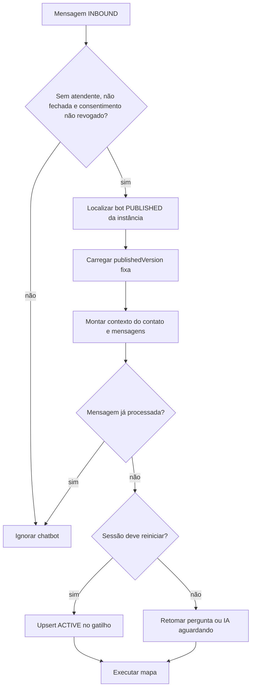
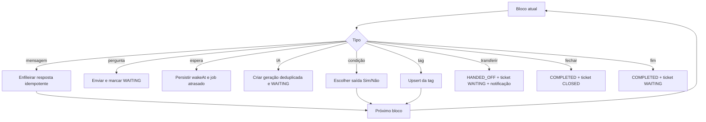
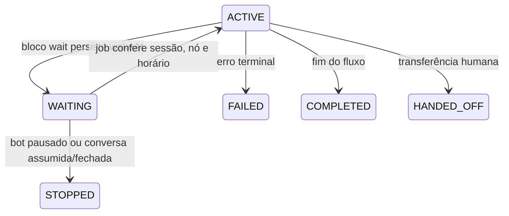

# Fluxos — Chatbots

## Mensagem recebida e sessão

```mermaid
flowchart TD
  A[Mensagem INBOUND] --> B{Sem atendente, não fechada e consentimento não revogado?}
  B -- não --> C[Ignorar chatbot]
  B -- sim --> D[Localizar bot PUBLISHED da instância]
  D --> E[Carregar publishedVersion fixa]
  E --> F[Montar contexto do contato e mensagens]
  F --> G{Mensagem já processada?}
  G -- sim --> C
  G -- não --> H{Sessão deve reiniciar?}
  H -- sim --> I[Upsert ACTIVE no gatilho]
  H -- não --> J[Retomar pergunta ou IA aguardando]
  I --> K[Executar mapa]
  J --> K
```

## Execução do mapa

```mermaid
flowchart TD
  A[Bloco atual] --> B{Tipo}
  B -- mensagem --> C[Enfileirar resposta idempotente]
  B -- pergunta --> D[Enviar e marcar WAITING]
  B -- espera --> E[Persistir wakeAt e job atrasado]
  B -- IA --> F[Criar geração deduplicada e WAITING]
  B -- condição --> G[Escolher saída Sim/Não]
  B -- tag --> H[Upsert da tag]
  B -- transferir --> I[HANDED_OFF + ticket WAITING + notificação]
  B -- fechar --> J[COMPLETED + ticket CLOSED]
  B -- fim --> K[COMPLETED + ticket WAITING]
  C --> L[Próximo bloco]
  G --> L
  H --> L
  L --> A
```

## Espera persistente

```mermaid
stateDiagram-v2
  ACTIVE --> WAITING: bloco wait persiste wakeAt
  WAITING --> ACTIVE: job confere sessão, nó e horário
  WAITING --> STOPPED: bot pausado ou conversa assumida/fechada
  ACTIVE --> FAILED: erro terminal
  ACTIVE --> COMPLETED: fim do fluxo
  ACTIVE --> HANDED_OFF: transferência humana
```
