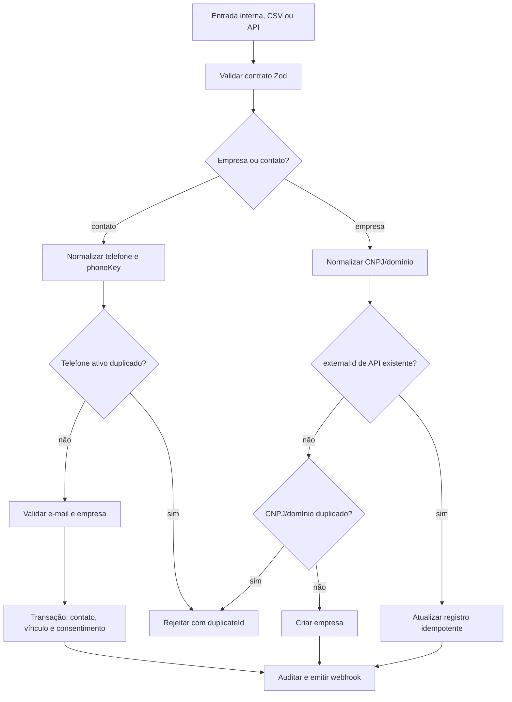
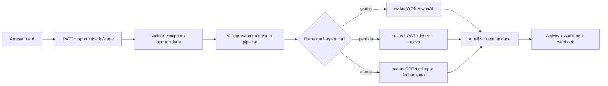
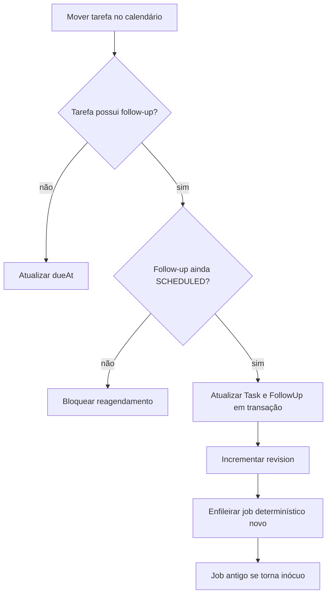

# Fluxos — CRM comercial

## Cadastro deduplicado

```mermaid
flowchart TD
  A[Entrada interna, CSV ou API] --> B[Validar contrato Zod]
  B --> C{Empresa ou contato?}
  C -- empresa --> D[Normalizar CNPJ/domínio]
  D --> E{externalId de API existente?}
  E -- sim --> F[Atualizar registro idempotente]
  E -- não --> G{CNPJ/domínio duplicado?}
  G -- sim --> H[Rejeitar com duplicateId]
  G -- não --> I[Criar empresa]
  C -- contato --> J[Normalizar telefone e phoneKey]
  J --> K{Telefone ativo duplicado?}
  K -- sim --> H
  K -- não --> L[Validar e-mail e empresa]
  L --> M[Transação: contato, vínculo e consentimento]
  F --> N[Auditar e emitir webhook]
  I --> N
  M --> N
```

## Movimentação no Kanban

```mermaid
flowchart LR
  A[Arrastar card] --> B[PATCH oportunidade/stage]
  B --> C[Validar escopo da oportunidade]
  C --> D[Validar etapa no mesmo pipeline]
  D --> E{Etapa ganha/perdida?}
  E -- ganha --> F[status WON + wonAt]
  E -- perdida --> G[status LOST + lostAt + motivo]
  E -- aberta --> H[status OPEN e limpar fechamento]
  F --> I[Atualizar oportunidade]
  G --> I
  H --> I
  I --> J[Activity + AuditLog + webhook]
```

## Tarefa vinculada a follow-up

```mermaid
flowchart TD
  A[Mover tarefa no calendário] --> B{Tarefa possui follow-up?}
  B -- não --> C[Atualizar dueAt]
  B -- sim --> D{Follow-up ainda SCHEDULED?}
  D -- não --> E[Bloquear reagendamento]
  D -- sim --> F[Atualizar Task e FollowUp em transação]
  F --> G[Incrementar revision]
  G --> H[Enfileirar job determinístico novo]
  H --> I[Job antigo se torna inócuo]
```
