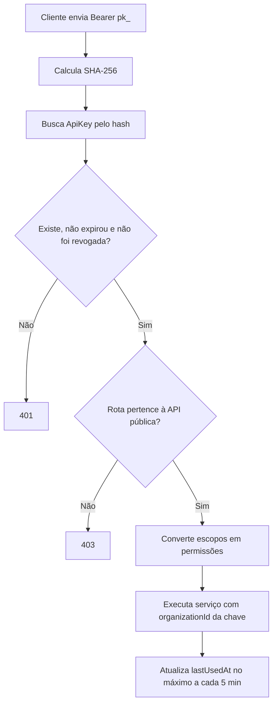
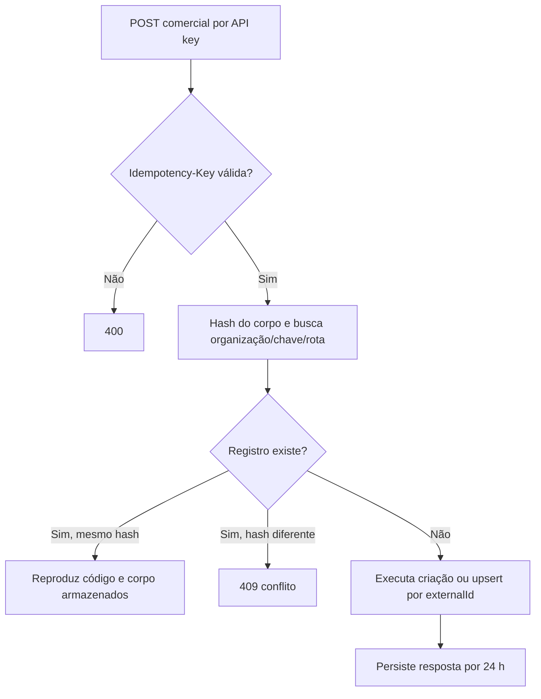
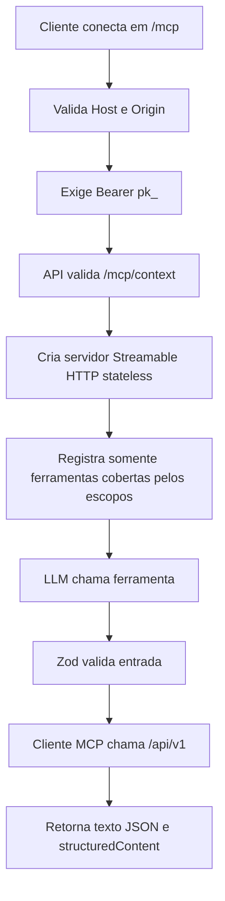

# Fluxos — API externa e servidor MCP

Escala: 🟢 confirmado pelo código | 🟡 inferido | 🔴 lacuna.

## Autenticação por chave e autorização

## Criação externa idempotente

## Sessão MCP e registro de ferramentas

