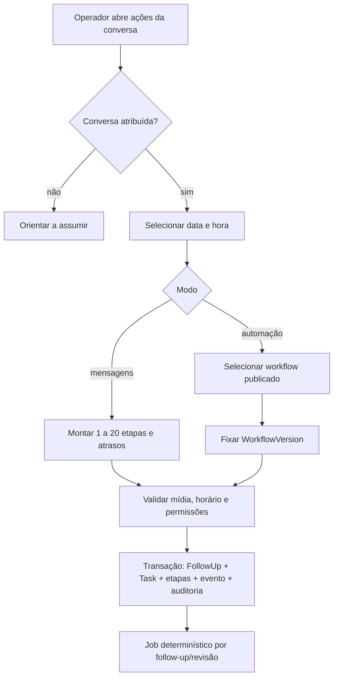
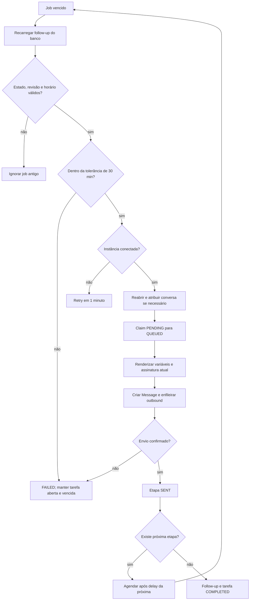
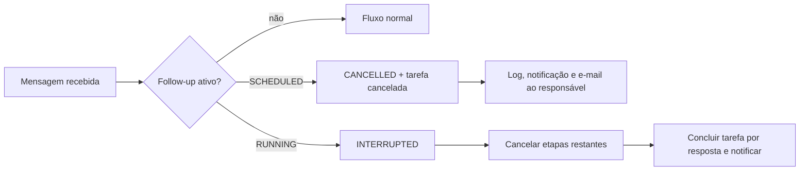

# Fluxos — Follow-ups automáticos

## Agendamento vinculado à agenda

```mermaid
flowchart TD
  A[Operador abre ações da conversa] --> B{Conversa atribuída?}
  B -- não --> C[Orientar a assumir]
  B -- sim --> D[Selecionar data e hora]
  D --> E{Modo}
  E -- mensagens --> F[Montar 1 a 20 etapas e atrasos]
  E -- automação --> G[Selecionar workflow publicado]
  F --> H[Validar mídia, horário e permissões]
  G --> I[Fixar WorkflowVersion]
  I --> H
  H --> J[Transação: FollowUp + Task + etapas + evento + auditoria]
  J --> K[Job determinístico por follow-up/revisão]
```

## Sequência de mensagens

```mermaid
flowchart TD
  A[Job vencido] --> B[Recarregar follow-up do banco]
  B --> C{Estado, revisão e horário válidos?}
  C -- não --> D[Ignorar job antigo]
  C -- sim --> E{Dentro da tolerância de 30 min?}
  E -- não --> F[FAILED; manter tarefa aberta e vencida]
  E -- sim --> G{Instância conectada?}
  G -- não --> H[Retry em 1 minuto]
  G -- sim --> I[Reabrir e atribuir conversa se necessário]
  I --> J[Claim PENDING para QUEUED]
  J --> K[Renderizar variáveis e assinatura atual]
  K --> L[Criar Message e enfileirar outbound]
  L --> M{Envio confirmado?}
  M -- não --> F
  M -- sim --> N[Etapa SENT]
  N --> O{Existe próxima etapa?}
  O -- sim --> P[Agendar após delay da próxima]
  O -- não --> Q[Follow-up e tarefa COMPLETED]
  P --> A
```

## Resposta do cliente

```mermaid
flowchart LR
  A[Mensagem recebida] --> B{Follow-up ativo?}
  B -- não --> C[Fluxo normal]
  B -- SCHEDULED --> D[CANCELLED + tarefa cancelada]
  D --> E[Log, notificação e e-mail ao responsável]
  B -- RUNNING --> F[INTERRUPTED]
  F --> G[Cancelar etapas restantes]
  G --> H[Concluir tarefa por resposta e notificar]
```
