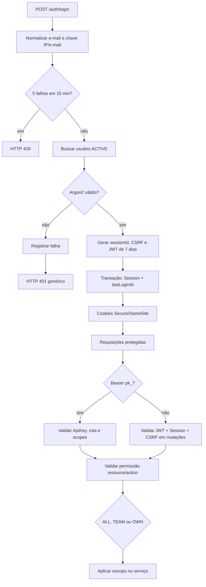
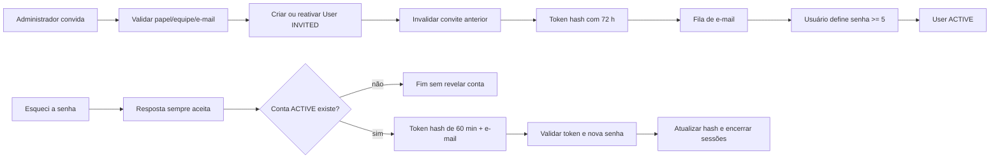

# Fluxos — Identidade e acesso

## Login e autorização

```mermaid
flowchart TD
  A[POST /auth/login] --> B[Normalizar e-mail e chave IP/e-mail]
  B --> C{5 falhas em 15 min?}
  C -- sim --> D[HTTP 429]
  C -- não --> E[Buscar usuário ACTIVE]
  E --> F{Argon2 válido?}
  F -- não --> G[Registrar falha]
  G --> H[HTTP 401 genérico]
  F -- sim --> I[Gerar sessionId, CSRF e JWT de 7 dias]
  I --> J[Transação: Session + lastLoginAt]
  J --> K[Cookies Secure/SameSite]
  K --> L[Requisições protegidas]
  L --> M{Bearer pk_?}
  M -- sim --> N[Validar ApiKey, rota e scopes]
  M -- não --> O[Validar JWT + Session + CSRF em mutações]
  N --> P[Validar permissão resource/action]
  O --> P
  P --> Q{ALL, TEAM ou OWN}
  Q --> R[Aplicar escopo no serviço]
```

## Convite e recuperação

```mermaid
flowchart LR
  A[Administrador convida] --> B[Validar papel/equipe/e-mail]
  B --> C[Criar ou reativar User INVITED]
  C --> D[Invalidar convite anterior]
  D --> E[Token hash com 72 h]
  E --> F[Fila de e-mail]
  F --> G[Usuário define senha >= 5]
  G --> H[User ACTIVE]

  I[Esqueci a senha] --> J[Resposta sempre aceita]
  J --> K{Conta ACTIVE existe?}
  K -- não --> L[Fim sem revelar conta]
  K -- sim --> M[Token hash de 60 min + e-mail]
  M --> N[Validar token e nova senha]
  N --> O[Atualizar hash e encerrar sessões]
```
