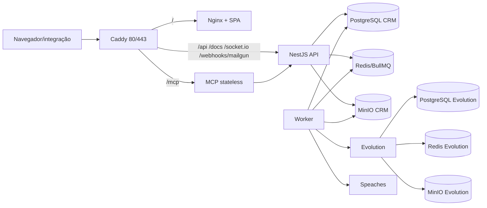
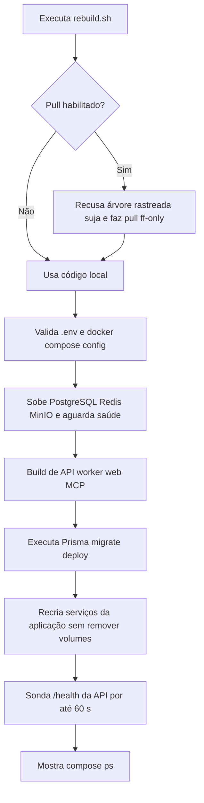
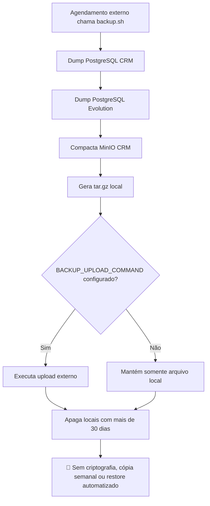

# Fluxos — Infraestrutura e operação

Escala: 🟢 confirmado pelo código | 🟡 inferido | 🔴 lacuna.

## Roteamento de produção

```mermaid
flowchart LR
    U[Navegador/integração] --> C[Caddy 80/443]
    C -->|/| W[Nginx + SPA]
    C -->|/api /docs /socket.io /webhooks/mailgun| A[NestJS API]
    C -->|/mcp| M[MCP stateless]
    A --> P[(PostgreSQL CRM)]
    A --> R[(Redis/BullMQ)]
    A --> S[(MinIO CRM)]
    M --> A
    K[Worker] --> P
    K --> R
    K --> S
    K --> E[Evolution]
    K --> T[Speaches]
    E --> EP[(PostgreSQL Evolution)]
    E --> ER[(Redis Evolution)]
    E --> ES[(MinIO Evolution)]
```

## Rebuild preservando dados

```mermaid
flowchart TD
    A[Executa rebuild.sh] --> B{Pull habilitado?}
    B -- Sim --> C[Recusa árvore rastreada suja e faz pull ff-only]
    B -- Não --> D[Usa código local]
    C --> D
    D --> E[Valida .env e docker compose config]
    E --> F[Sobe PostgreSQL Redis MinIO e aguarda saúde]
    F --> G[Build de API worker web MCP]
    G --> H[Executa Prisma migrate deploy]
    H --> I[Recria serviços da aplicação sem remover volumes]
    I --> J[Sonda /health da API por até 60 s]
    J --> K[Mostra compose ps]
```

## Backup atual e lacunas

```mermaid
flowchart TD
    A[Agendamento externo chama backup.sh] --> B[Dump PostgreSQL CRM]
    B --> C[Dump PostgreSQL Evolution]
    C --> D[Compacta MinIO CRM]
    D --> E[Gera tar.gz local]
    E --> F{BACKUP_UPLOAD_COMMAND configurado?}
    F -- Sim --> G[Executa upload externo]
    F -- Não --> H[Mantém somente arquivo local]
    G --> I[Apaga locais com mais de 30 dias]
    H --> I
    I --> J[🔴 Sem criptografia, cópia semanal ou restore automatizado]
```

