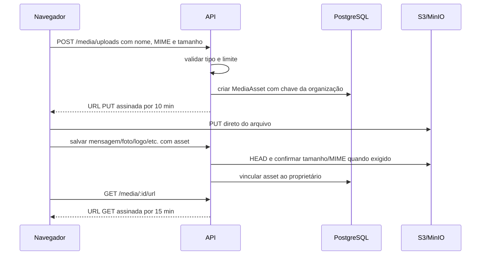
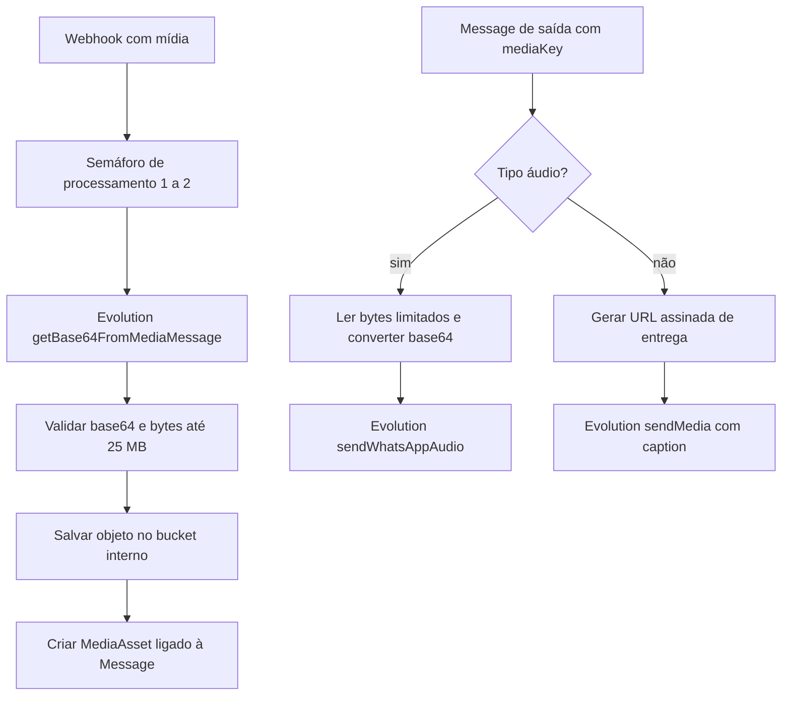
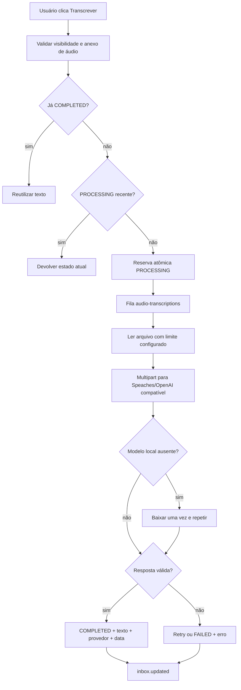

# Fluxos — Mídias e transcrição

## Upload direto e vínculo seguro

```mermaid
sequenceDiagram
  participant U as Navegador
  participant API
  participant DB as PostgreSQL
  participant S as S3/MinIO
  U->>API: POST /media/uploads com nome, MIME e tamanho
  API->>API: validar tipo e limite
  API->>DB: criar MediaAsset com chave da organização
  API-->>U: URL PUT assinada por 10 min
  U->>S: PUT direto do arquivo
  U->>API: salvar mensagem/foto/logo/etc. com asset
  API->>S: HEAD e confirmar tamanho/MIME quando exigido
  API->>DB: vincular asset ao proprietário
  U->>API: GET /media/:id/url
  API-->>U: URL GET assinada por 15 min
```

## Mídia recebida e envio pela Evolution

```mermaid
flowchart TD
  A[Webhook com mídia] --> B[Semáforo de processamento 1 a 2]
  B --> C[Evolution getBase64FromMediaMessage]
  C --> D[Validar base64 e bytes até 25 MB]
  D --> E[Salvar objeto no bucket interno]
  E --> F[Criar MediaAsset ligado à Message]
  G[Message de saída com mediaKey] --> H{Tipo áudio?}
  H -- sim --> I[Ler bytes limitados e converter base64]
  H -- não --> J[Gerar URL assinada de entrega]
  I --> K[Evolution sendWhatsAppAudio]
  J --> L[Evolution sendMedia com caption]
```

## Transcrição persistente

```mermaid
flowchart TD
  A[Usuário clica Transcrever] --> B[Validar visibilidade e anexo de áudio]
  B --> C{Já COMPLETED?}
  C -- sim --> D[Reutilizar texto]
  C -- não --> E{PROCESSING recente?}
  E -- sim --> F[Devolver estado atual]
  E -- não --> G[Reserva atômica PROCESSING]
  G --> H[Fila audio-transcriptions]
  H --> I[Ler arquivo com limite configurado]
  I --> J[Multipart para Speaches/OpenAI compatível]
  J --> K{Modelo local ausente?}
  K -- sim --> L[Baixar uma vez e repetir]
  K -- não --> M{Resposta válida?}
  L --> M
  M -- sim --> N[COMPLETED + texto + provedor + data]
  M -- não --> O[Retry ou FAILED + erro]
  N --> P[inbox.updated]
  O --> P
```
