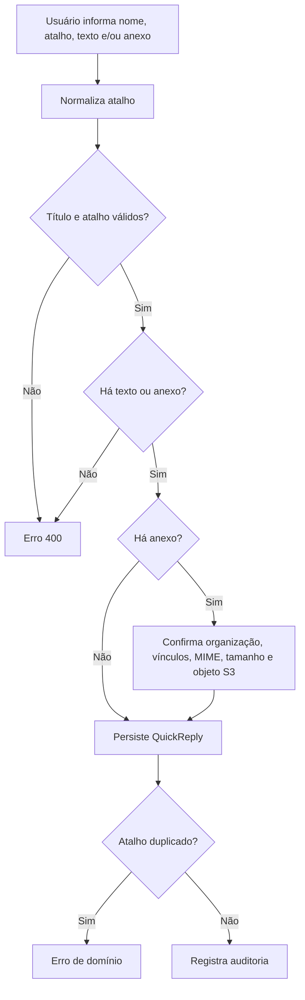
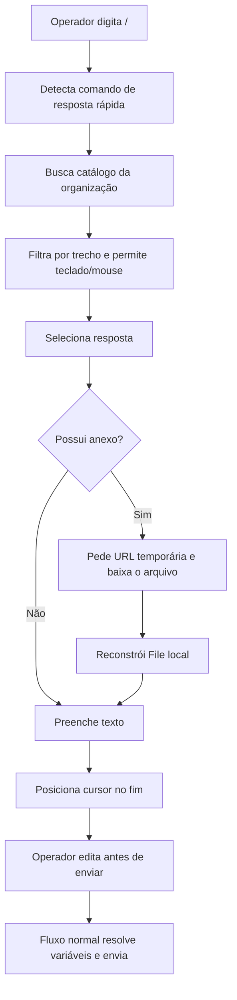
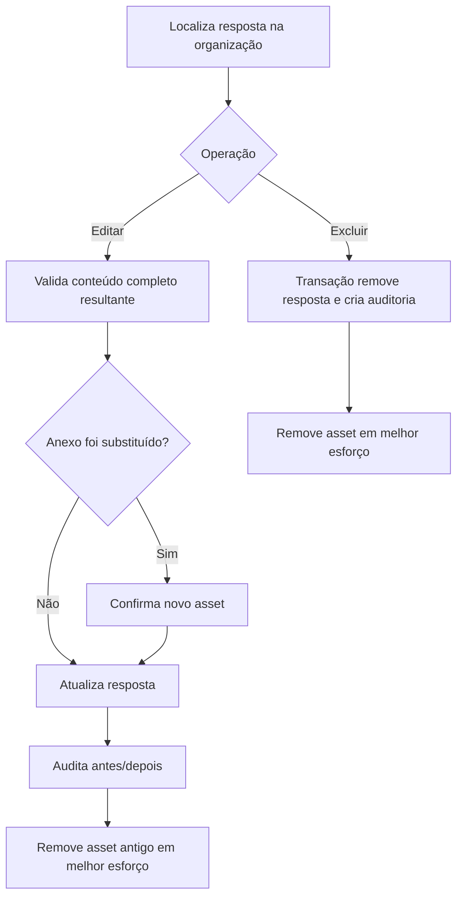

# Fluxos — Respostas rápidas

Escala: 🟢 confirmado pelo código | 🟡 inferido | 🔴 lacuna.

## Criação e validação

```mermaid
flowchart TD
    A[Usuário informa nome, atalho, texto e/ou anexo] --> B[Normaliza atalho]
    B --> C{Título e atalho válidos?}
    C -- Não --> D[Erro 400]
    C -- Sim --> E{Há texto ou anexo?}
    E -- Não --> D
    E -- Sim --> F{Há anexo?}
    F -- Sim --> G[Confirma organização, vínculos, MIME, tamanho e objeto S3]
    F -- Não --> H[Persiste QuickReply]
    G --> H
    H --> I{Atalho duplicado?}
    I -- Sim --> J[Erro de domínio]
    I -- Não --> K[Registra auditoria]
```

## Inserção pelo composer

```mermaid
flowchart TD
    A[Operador digita /] --> B[Detecta comando de resposta rápida]
    B --> C[Busca catálogo da organização]
    C --> D[Filtra por trecho e permite teclado/mouse]
    D --> E[Seleciona resposta]
    E --> F{Possui anexo?}
    F -- Sim --> G[Pede URL temporária e baixa o arquivo]
    G --> H[Reconstrói File local]
    F -- Não --> I[Preenche texto]
    H --> I
    I --> J[Posiciona cursor no fim]
    J --> K[Operador edita antes de enviar]
    K --> L[Fluxo normal resolve variáveis e envia]
```

## Edição e exclusão

```mermaid
flowchart TD
    A[Localiza resposta na organização] --> B{Operação}
    B -- Editar --> C[Valida conteúdo completo resultante]
    C --> D{Anexo foi substituído?}
    D -- Sim --> E[Confirma novo asset]
    D -- Não --> F[Atualiza resposta]
    E --> F
    F --> G[Audita antes/depois]
    G --> H[Remove asset antigo em melhor esforço]
    B -- Excluir --> I[Transação remove resposta e cria auditoria]
    I --> J[Remove asset em melhor esforço]
```
