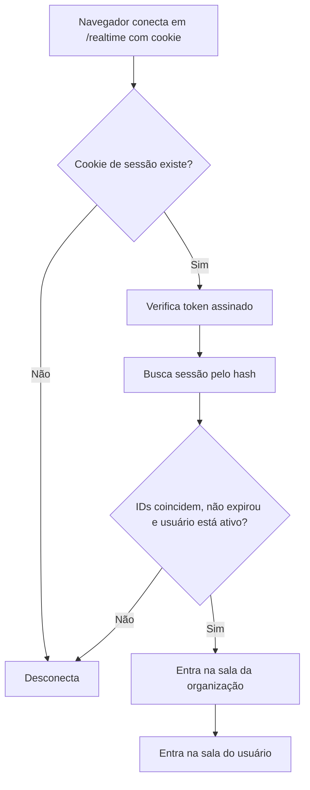
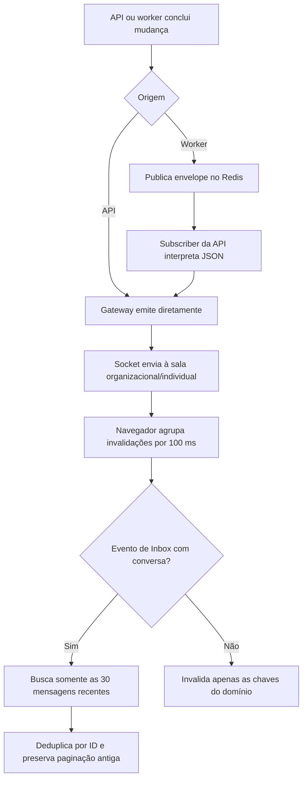
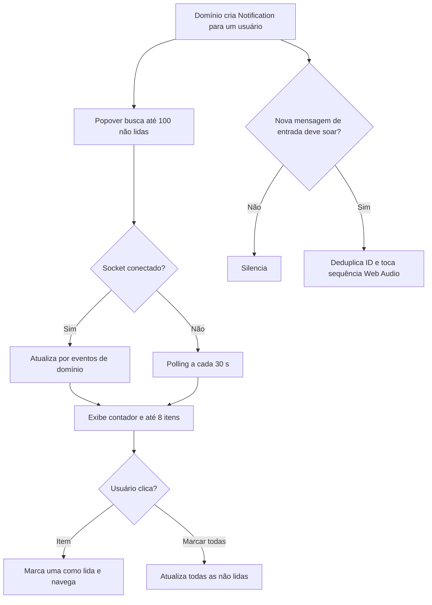

# Fluxos — Tempo real e notificações

Escala: 🟢 confirmado pelo código | 🟡 inferido | 🔴 lacuna.

## Autenticação e salas Socket.IO

## Propagação e atualização seletiva

## Notificação persistente e aviso sonoro

