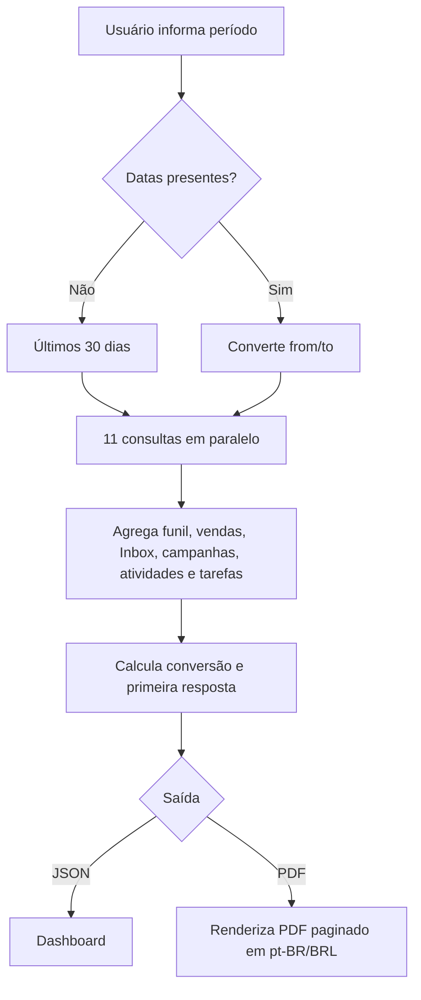
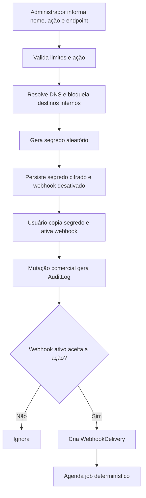
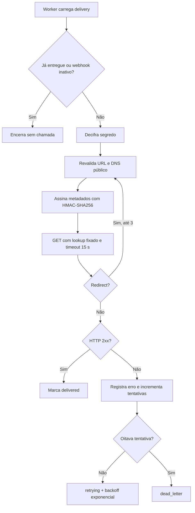

# Fluxos — Relatórios e webhooks externos

Escala: 🟢 confirmado pelo código | 🟡 inferido | 🔴 lacuna.

## Resumo gerencial e PDF

## Cadastro e disparo de webhook

## Entrega segura e retentativas

