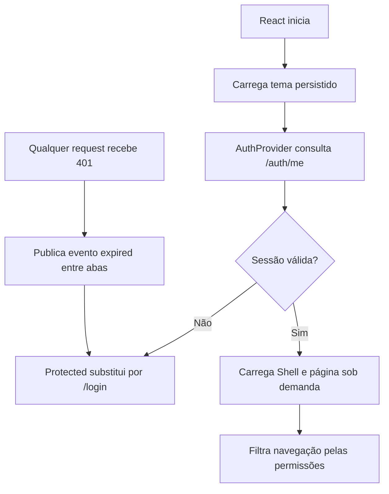
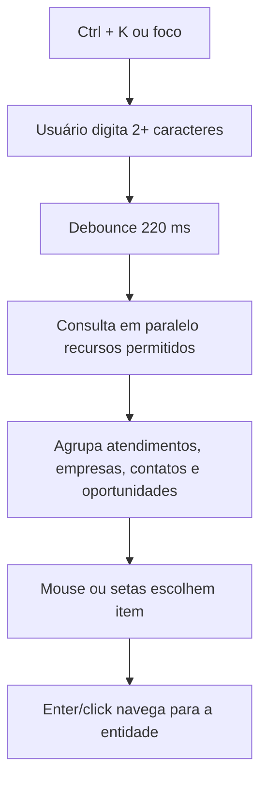
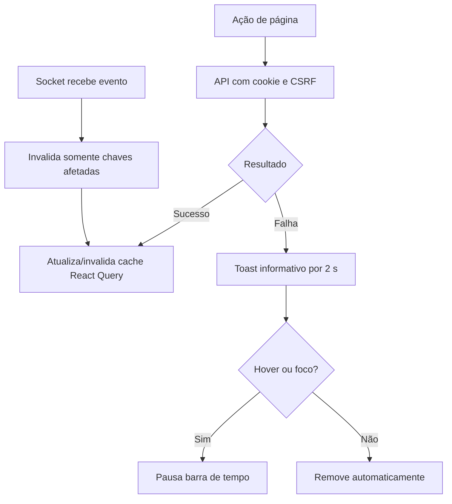

# Fluxos — Interface web

Escala: 🟢 confirmado pelo código | 🟡 inferido | 🔴 lacuna.

## Bootstrap e proteção de rotas

```mermaid
flowchart TD
    A[React inicia] --> B[Carrega tema persistido]
    B --> C[AuthProvider consulta /auth/me]
    C --> D{Sessão válida?}
    D -- Não --> E[Protected substitui por /login]
    D -- Sim --> F[Carrega Shell e página sob demanda]
    F --> G[Filtra navegação pelas permissões]
    H[Qualquer request recebe 401] --> I[Publica evento expired entre abas]
    I --> E
```

## Busca global

```mermaid
flowchart TD
    A[Ctrl + K ou foco] --> B[Usuário digita 2+ caracteres]
    B --> C[Debounce 220 ms]
    C --> D[Consulta em paralelo recursos permitidos]
    D --> E[Agrupa atendimentos, empresas, contatos e oportunidades]
    E --> F[Mouse ou setas escolhem item]
    F --> G[Enter/click navega para a entidade]
```

## Feedback e atualização de estado

```mermaid
flowchart TD
    A[Ação de página] --> B[API com cookie e CSRF]
    B --> C{Resultado}
    C -- Sucesso --> D[Atualiza/invalida cache React Query]
    C -- Falha --> E[Toast informativo por 2 s]
    F[Socket recebe evento] --> G[Invalida somente chaves afetadas]
    G --> D
    E --> H{Hover ou foco?}
    H -- Sim --> I[Pausa barra de tempo]
    H -- Não --> J[Remove automaticamente]
```

