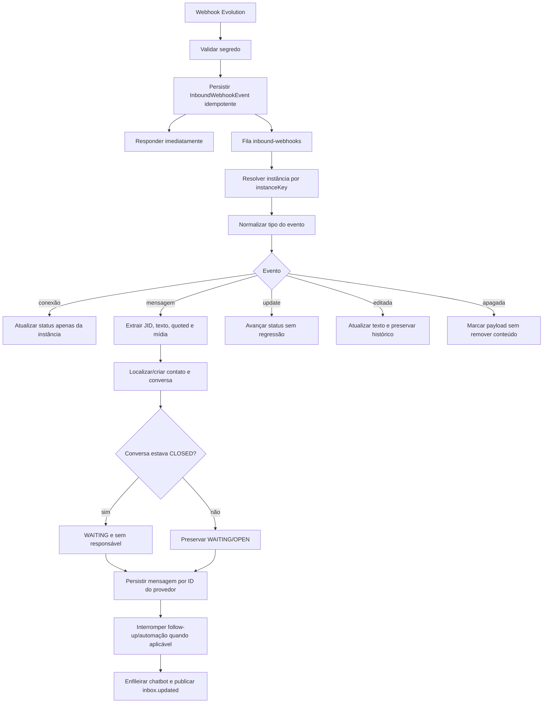
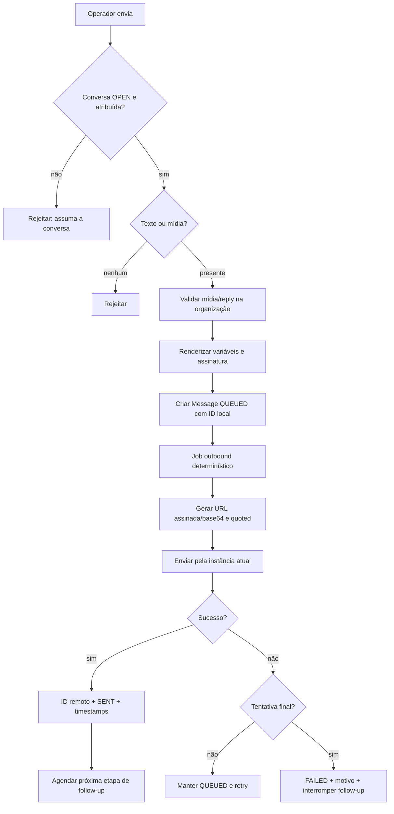
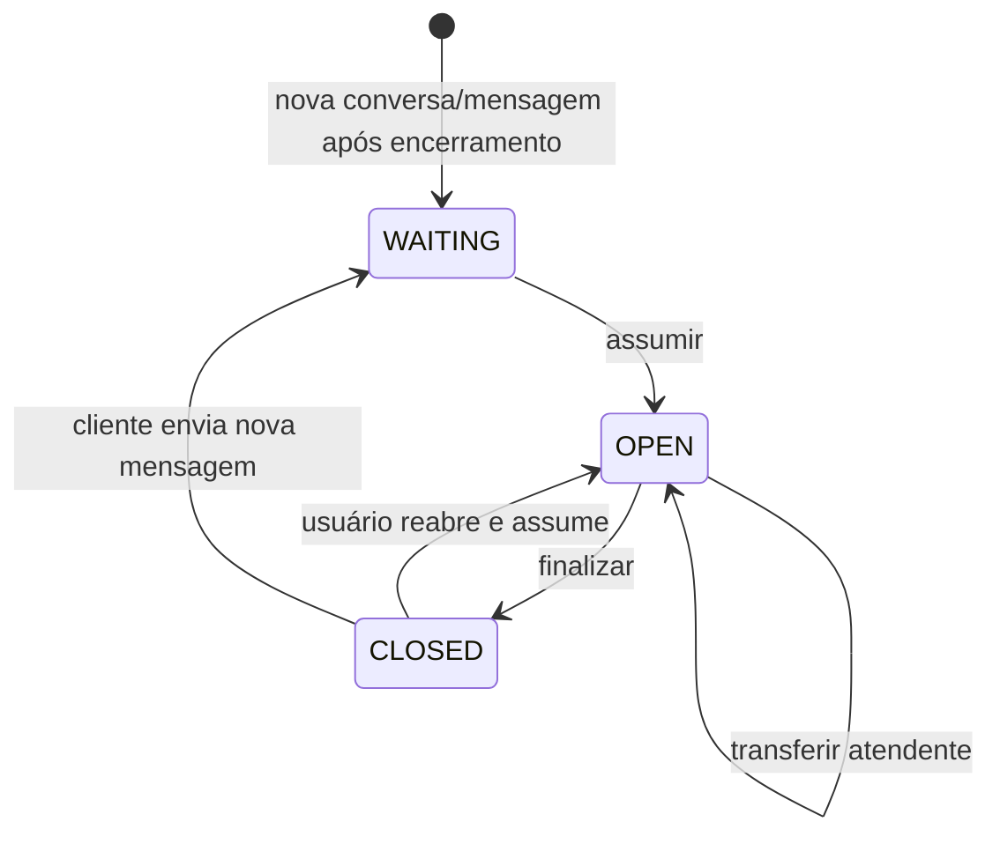

# Fluxos — WhatsApp e Inbox

## Mensagem recebida

```mermaid
flowchart TD
  A[Webhook Evolution] --> B[Validar segredo]
  B --> C[Persistir InboundWebhookEvent idempotente]
  C --> D[Responder imediatamente]
  C --> E[Fila inbound-webhooks]
  E --> F[Resolver instância por instanceKey]
  F --> G[Normalizar tipo do evento]
  G --> H{Evento}
  H -- conexão --> I[Atualizar status apenas da instância]
  H -- mensagem --> J[Extrair JID, texto, quoted e mídia]
  H -- update --> K[Avançar status sem regressão]
  H -- editada --> L[Atualizar texto e preservar histórico]
  H -- apagada --> M[Marcar payload sem remover conteúdo]
  J --> N[Localizar/criar contato e conversa]
  N --> O{Conversa estava CLOSED?}
  O -- sim --> P[WAITING e sem responsável]
  O -- não --> Q[Preservar WAITING/OPEN]
  P --> R[Persistir mensagem por ID do provedor]
  Q --> R
  R --> S[Interromper follow-up/automação quando aplicável]
  S --> T[Enfileirar chatbot e publicar inbox.updated]
```

## Mensagem enviada

```mermaid
flowchart TD
  A[Operador envia] --> B{Conversa OPEN e atribuída?}
  B -- não --> C[Rejeitar: assuma a conversa]
  B -- sim --> D{Texto ou mídia?}
  D -- nenhum --> E[Rejeitar]
  D -- presente --> F[Validar mídia/reply na organização]
  F --> G[Renderizar variáveis e assinatura]
  G --> H[Criar Message QUEUED com ID local]
  H --> I[Job outbound determinístico]
  I --> J[Gerar URL assinada/base64 e quoted]
  J --> K[Enviar pela instância atual]
  K --> L{Sucesso?}
  L -- sim --> M[ID remoto + SENT + timestamps]
  M --> N[Agendar próxima etapa de follow-up]
  L -- não --> O{Tentativa final?}
  O -- não --> P[Manter QUEUED e retry]
  O -- sim --> Q[FAILED + motivo + interromper follow-up]
```

## Ciclo do ticket

```mermaid
stateDiagram-v2
  [*] --> WAITING: nova conversa/mensagem após encerramento
  WAITING --> OPEN: assumir
  OPEN --> OPEN: transferir atendente
  OPEN --> CLOSED: finalizar
  CLOSED --> OPEN: usuário reabre e assume
  CLOSED --> WAITING: cliente envia nova mensagem
```
