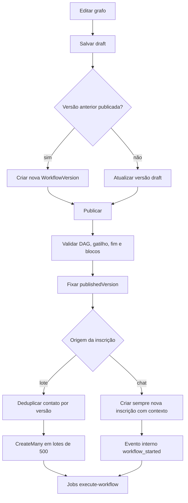
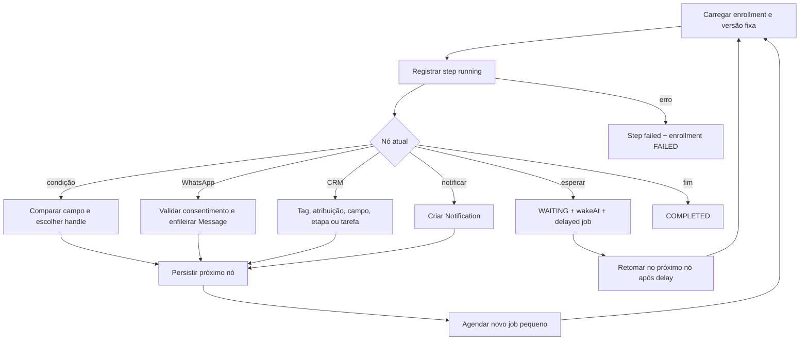
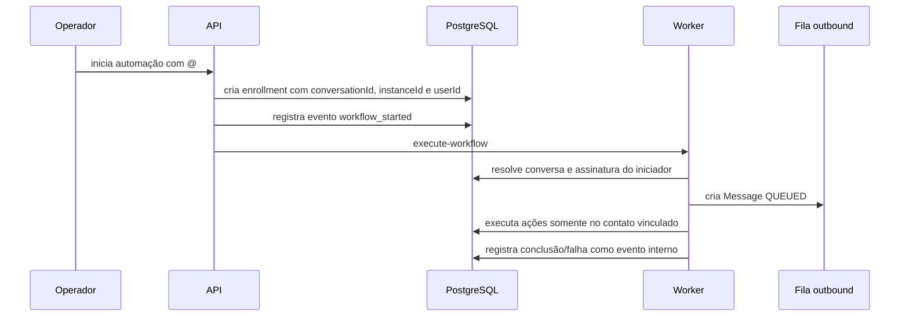

# Fluxos — Automações

## Publicação e inscrição

```mermaid
flowchart TD
  A[Editar grafo] --> B[Salvar draft]
  B --> C{Versão anterior publicada?}
  C -- sim --> D[Criar nova WorkflowVersion]
  C -- não --> E[Atualizar versão draft]
  D --> F[Publicar]
  E --> F
  F --> G[Validar DAG, gatilho, fim e blocos]
  G --> H[Fixar publishedVersion]
  H --> I{Origem da inscrição}
  I -- lote --> J[Deduplicar contato por versão]
  I -- chat --> K[Criar sempre nova inscrição com contexto]
  J --> L[CreateMany em lotes de 500]
  K --> M[Evento interno workflow_started]
  L --> N[Jobs execute-workflow]
  M --> N
```

## Motor de um nó por job

```mermaid
flowchart TD
  A[Carregar enrollment e versão fixa] --> B[Registrar step running]
  B --> C{Nó atual}
  C -- condição --> D[Comparar campo e escolher handle]
  C -- esperar --> E[WAITING + wakeAt + delayed job]
  C -- WhatsApp --> F[Validar consentimento e enfileirar Message]
  C -- CRM --> G[Tag, atribuição, campo, etapa ou tarefa]
  C -- notificar --> H[Criar Notification]
  C -- fim --> I[COMPLETED]
  D --> J[Persistir próximo nó]
  F --> J
  G --> J
  H --> J
  J --> K[Agendar novo job pequeno]
  E --> L[Retomar no próximo nó após delay]
  K --> A
  L --> A
  B -->|erro| M[Step failed + enrollment FAILED]
```

## Envio iniciado pela conversa

```mermaid
sequenceDiagram
  participant U as Operador
  participant API
  participant DB as PostgreSQL
  participant W as Worker
  participant O as Fila outbound
  U->>API: inicia automação com @
  API->>DB: cria enrollment com conversationId, instanceId e userId
  API->>DB: registra evento workflow_started
  API->>W: execute-workflow
  W->>DB: resolve conversa e assinatura do iniciador
  W->>O: cria Message QUEUED
  W->>DB: executa ações somente no contato vinculado
  W->>DB: registra conclusão/falha como evento interno
```
