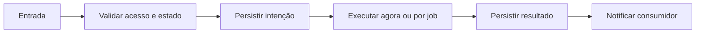

# Agendar e editar follow-up — Design

## Fluxo

Menu da conversa/tarefa → data → horário → mensagens ou workflow → transação FollowUp+Task → delayed job **[CONFIRMADO]**

**[INFERIDO]**

## Falhas e retomada

- Entrada inválida falha antes do efeito. **[CONFIRMADO]**
- Falha de dependência mantém motivo sanitizado e segue retry delimitado. **[CONFIRMADO]**
- Reinício recupera pelo banco e não pela memória do processo. **[CONFIRMADO]**
- Resultado obsoleto não substitui estado mais recente. **[INFERIDO]**

## Referências

`apps/api/src/follow-ups/follow-ups.service.ts`, `apps/web/src/components/FollowUpModal.tsx`, `apps/web/src/pages/Tasks.tsx`. **[CONFIRMADO]**
