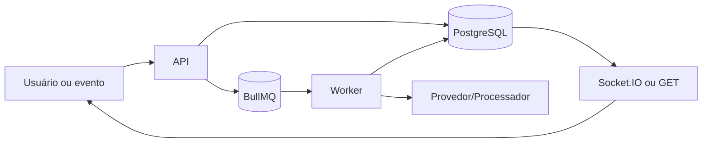

# Follow-ups automáticos — Design

## Componentes

- A API autentica, valida e persiste a intenção de trabalho. **[CONFIRMADO]**
- O worker executa integrações, geração, conversão ou retentativas fora do ciclo HTTP. **[CONFIRMADO]**
- PostgreSQL guarda estado comercial; Redis/BullMQ coordena execução. **[CONFIRMADO]**
- Socket.IO ou consulta específica entrega o resultado à interface. **[CONFIRMADO]**

## Interfaces

- `GET /api/v1/conversations/:conversationId/follow-ups/active`. **[CONFIRMADO]**
- `POST /api/v1/conversations/:conversationId/follow-ups`. **[CONFIRMADO]**
- `PATCH /api/v1/conversations/:conversationId/follow-ups/:followUpId`. **[CONFIRMADO]**
- `DELETE /api/v1/conversations/:conversationId/follow-ups/:followUpId`. **[CONFIRMADO]**

## Fluxo

**[INFERIDO]**

## Consistência e observabilidade

- O worker relê status e revisão antes do efeito externo. **[CONFIRMADO]**
- Estados terminais impedem jobs antigos de reativar o fluxo. **[INFERIDO]**
- Erros persistem código/motivo sanitizado e contagem de tentativa quando aplicável. **[CONFIRMADO]**
- Logs técnicos correlacionam organização, entidade e job sem conteúdo secreto. **[INFERIDO]**

## Riscos

- Dependência externa lenta pode acumular fila; concorrência e timeout devem permanecer delimitados. **[INFERIDO]**
- Dados volumosos devem ser paginados ou processados em chunks. **[INFERIDO]**
- Mudança de estado concorrente exige validação otimista ou transação. **[INFERIDO]**

## Referências

`apps/api/src/follow-ups/follow-ups.controller.ts`, `apps/api/src/follow-ups/follow-ups.service.ts`, `apps/worker/src/follow-up.processor.ts`, `apps/web/src/components/FollowUpModal.tsx`, `packages/database/prisma/schema.prisma`. **[CONFIRMADO]**
