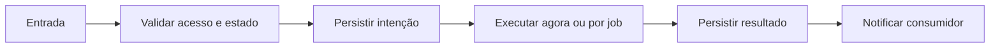

# Pré-atendimento por IA — Design

## Fluxo

Mensagem sem atendente → nó ai_conversation → geração prioritária → continuar ou fallback → handoff + propostas **[CONFIRMADO]**

**[INFERIDO]**

## Falhas e retomada

- Entrada inválida falha antes do efeito. **[CONFIRMADO]**
- Falha de dependência mantém motivo sanitizado e segue retry delimitado. **[CONFIRMADO]**
- Reinício recupera pelo banco e não pela memória do processo. **[CONFIRMADO]**
- Resultado obsoleto não substitui estado mais recente. **[INFERIDO]**

## Referências

`apps/worker/src/ai.processor.ts`, `apps/worker/src/chatbot.processor.ts`, `apps/api/src/ai`. **[CONFIRMADO]**
