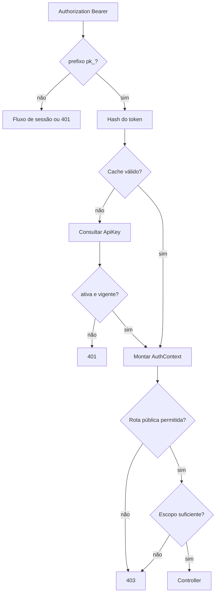

# Chaves de API — Design

## Emissão

`UsersService.createApiKey` gera material aleatório com prefixo `pk_`, calcula o hash seguro, persiste metadados e devolve o segredo somente junto da resposta inicial. **[CONFIRMADO]**

## Autenticação

**[CONFIRMADO]**

## Idempotência

O interceptor identifica criações externas sensíveis, exige `Idempotency-Key` para autenticação por chave e reutiliza a resposta persistida da mesma combinação autorizada. **[CONFIRMADO]**

## Estado e observabilidade

- O registro contém organização, nome, hash, prefixo, escopos, expiração, revogação e último uso. **[CONFIRMADO]**
- O último uso é atualizado no máximo uma vez por janela aproximada de cinco minutos para reduzir escrita. **[CONFIRMADO]**
- Falha ao atualizar `lastUsedAt` invalida o cache e não deve conceder acesso extra. **[CONFIRMADO]**
- Criação e revogação devem constar na auditoria, sem o token integral. **[CONFIRMADO]**

## Riscos

- Quem copiar o token possui o acesso concedido até expiração ou revogação; a interface deve recomendar armazenamento seguro. **[INFERIDO]**
- O cache local requer invalidação distribuída se a API passar a usar múltiplas réplicas. **[INFERIDO]**
- A allowlist de caminhos no guard deve evoluir junto da documentação pública para não expor rotas internas por engano. **[CONFIRMADO]**

## Referências

`apps/api/src/users/users.service.ts`, `apps/api/src/auth/auth.guard.ts`, `auth-cache.service.ts`, `apps/api/src/common/idempotency.interceptor.ts`, `apps/api/src/swagger/public-api-document.ts`. **[CONFIRMADO]**
