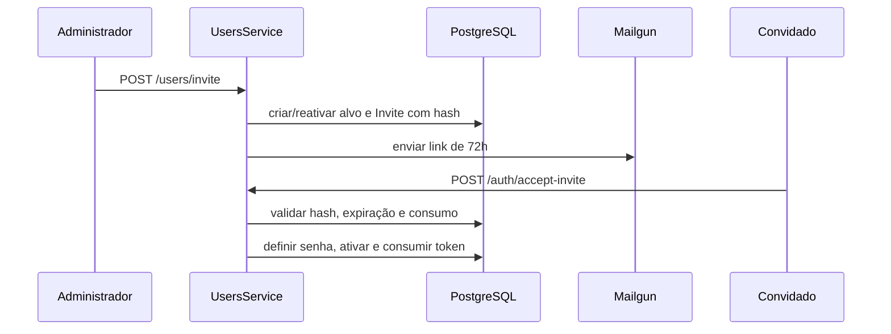
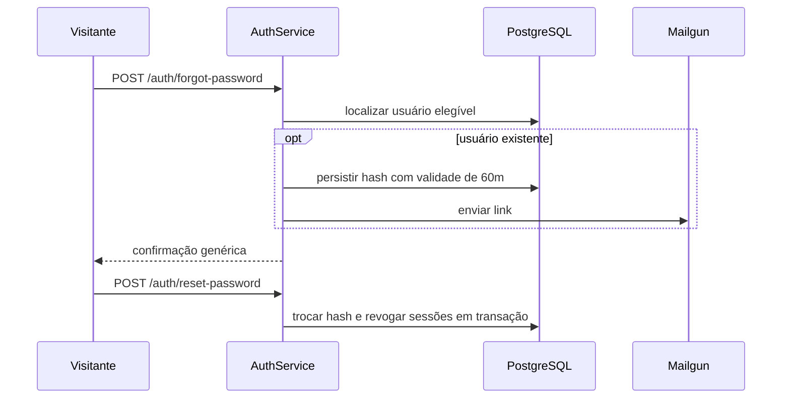

# Convites e recuperação — Design

## Fluxo de convite

**[CONFIRMADO]**

## Fluxo de recuperação

**[CONFIRMADO]**

## Segurança

- O URL público usado no e-mail deriva da configuração do ambiente, não de IP fixo no código. **[CONFIRMADO]**
- Tokens enviados ao destinatário são comparados ao material derivado persistido. **[CONFIRMADO]**
- Solicitações de recuperação possuem limitação de tentativas e resposta constante. **[CONFIRMADO]**
- O provedor Mailgun é transacional neste fluxo; campanhas manuais de e-mail usam configuração separada. **[CONFIRMADO]**

## Falhas

- Falha de envio não deve ativar o usuário nem expor o token em logs. **[INFERIDO]**
- Token expirado, consumido ou adulterado encerra o fluxo sem alterar credenciais. **[CONFIRMADO]**
- A recuperação continua indisponível quando o provedor transacional obrigatório não está configurado. **[INFERIDO]**

## Referências

`apps/api/src/auth/auth.service.ts`, `apps/api/src/users/users.service.ts`, integração Mailgun em `apps/api/src/email` e schema Prisma. **[CONFIRMADO]**
