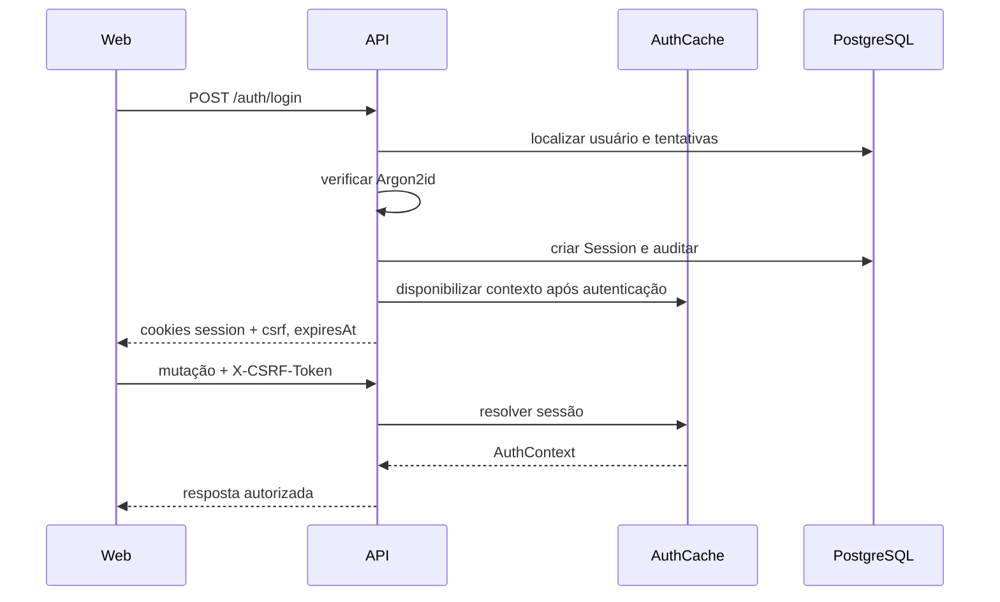
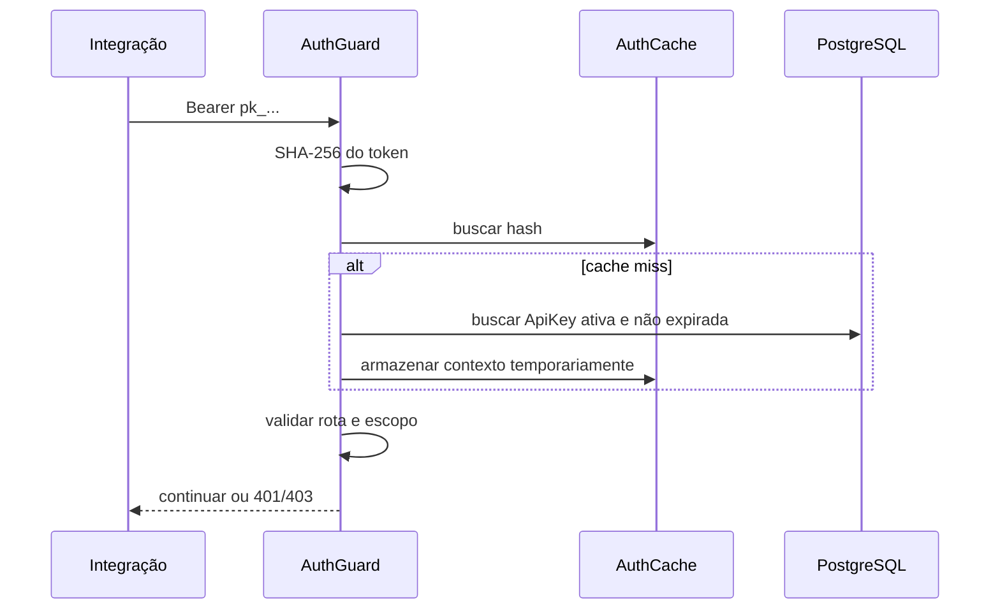

# Identidade e acesso — Design

## Contexto do componente

O módulo é implementado pela API NestJS e compartilha Prisma, cache local de autenticação, serviço transacional de e-mail, armazenamento de mídia e auditoria com os demais contextos da organização. **[CONFIRMADO]**

O `AuthGuard` global decide entre sessão por cookie e chave de API por bearer token; decorators públicos e de permissão refinam essa decisão por rota. **[CONFIRMADO]**

## Componentes

| Componente | Responsabilidade | Dependências | Confiança |
|---|---|---|---|
| `AuthController` | Login, logout, convite, recuperação e contexto atual. | `AuthService`, cookies Express. | **[CONFIRMADO]** |
| `AuthService` | Credenciais, tokens, sessões, limites e auditoria. | Prisma, Argon2, JWT, e-mail. | **[CONFIRMADO]** |
| `AuthGuard` | Autenticar cookie ou `pk_`, limitar superfície pública da chave e montar `AuthContext`. | Prisma, `AuthCacheService`. | **[CONFIRMADO]** |
| `CsrfGuard` | Comparar o token enviado com o vínculo da sessão em mutações aplicáveis. | Requisição e contexto autenticado. | **[CONFIRMADO]** |
| `PermissionGuard` | Exigir recurso/ação e calcular escopo autorizado. | Papel e permissões do contexto. | **[CONFIRMADO]** |
| `UsersController` | Expor administração de usuários, perfil, foto, papéis e chaves. | `UsersService`. | **[CONFIRMADO]** |
| `UsersService` | Aplicar invariantes de identidade, equipe, papéis, convites e chaves. | Prisma, mídia, e-mail, auditoria. | **[CONFIRMADO]** |
| `AuthCacheService` | Reduzir consultas de autenticação com TTL e limite de entradas. | Memória do processo da API. | **[CONFIRMADO]** |

## Interfaces HTTP

| Método e rota | Entrada principal | Saída principal | Proteção |
|---|---|---|---|
| `POST /api/v1/auth/login` | `email`, `password` | `expiresAt` e cookies | Pública + rate limit interno **[CONFIRMADO]** |
| `POST /api/v1/auth/logout` | Cookie de sessão | `success` | Sessão + CSRF **[CONFIRMADO]** |
| `POST /api/v1/auth/accept-invite` | `token`, `password`, `name?` | `success` | Pública, token de uso único **[CONFIRMADO]** |
| `POST /api/v1/auth/forgot-password` | `email` | confirmação genérica | Pública + rate limit interno **[CONFIRMADO]** |
| `POST /api/v1/auth/reset-password` | `token`, `password` | `success` | Pública, token de uso único **[CONFIRMADO]** |
| `GET /api/v1/auth/me` | Cookie ou bearer aceito | `AuthContext` | Autenticada **[CONFIRMADO]** |
| `GET /api/v1/users` | — | usuários visíveis | `users:read` **[CONFIRMADO]** |
| `POST /api/v1/users/invite` | nome, e-mail, papel, equipe | convite criado | `users:write` **[CONFIRMADO]** |
| `PATCH /api/v1/users/:id` | nome, e-mail, papel, equipe | usuário alterado | `users:write` **[CONFIRMADO]** |
| `DELETE /api/v1/users/:id` | — | resultado da desativação | `users:write` **[CONFIRMADO]** |
| `PUT /api/v1/users/roles/:id/permissions` | lista de permissões | papel atualizado | `users:write` **[CONFIRMADO]** |
| `POST /api/v1/users/api-keys` | nome, escopos, expiração | registro e segredo único | `api_keys:write` **[CONFIRMADO]** |

## Fluxos

### Login por navegador

**[CONFIRMADO]**

### Autenticação de API

**[CONFIRMADO]**

## Estado e persistência

- `Session` liga usuário, token/hash, CSRF, expiração e metadados de cliente. **[CONFIRMADO]**
- `Invite` e `PasswordResetToken` são credenciais temporárias, expiradas e consumíveis uma única vez. **[CONFIRMADO]**
- `RolePermission` relaciona papel, recurso, ação e escopo de dados. **[CONFIRMADO]**
- `ApiKey` guarda hash, prefixo, escopos, expiração e último uso; o segredo completo não é recuperável. **[CONFIRMADO]**
- `AuditLog` preserva ator, ação, entidade e metadados de mudanças sensíveis. **[CONFIRMADO]**

## Decisões e alternativas

- Cookies seguros foram escolhidos para usuários humanos porque evitam expor o token persistente ao JavaScript e funcionam entre abas do mesmo navegador. **[CONFIRMADO]**
- Bearer token foi reservado às integrações porque clientes externos não participam do fluxo de cookie e CSRF. **[CONFIRMADO]**
- O cache de autenticação é local ao processo, não Redis; invalidações críticas também atualizam o banco, mas múltiplas réplicas exigiriam um mecanismo distribuído. **[INFERIDO]**
- Não foi adotado provedor externo de identidade; SSO/MFA exigiriam uma ADR e migração compatível de sessões. **[CONFIRMADO]**

## Observabilidade

- Falhas de login, criação/revogação de sessão, convites, redefinições, usuários, papéis e chaves devem ser correlacionáveis em auditoria. **[CONFIRMADO]**
- Erros assíncronos de atualização do último uso de uma chave invalidam a entrada de cache para evitar perpetuar dado inconsistente. **[CONFIRMADO]**
- Não há métrica explícita documentada para taxa de acerto do cache ou volume de bloqueios de login. **[A VALIDAR]**

## Riscos e limites

1. O cache local não compartilha invalidação entre múltiplas instâncias da API. **[INFERIDO]**
2. A senha mínima de cinco caracteres atende a regra atual, mas é fraca sem política complementar ou MFA. **[CONFIRMADO]**
3. O token de API completo é irrecuperável; perda exige revogação/criação de outra chave. **[CONFIRMADO]**
4. A consistência entre abas depende da reação da interface a `401` e, para propagação imediata, de eventos do navegador. **[CONFIRMADO]**
5. As rotas de criação e listagem de chaves compartilham o prefixo de usuários, o que aumenta a importância de documentação pública precisa. **[CONFIRMADO]**

## Referências de implementação

- `apps/api/src/auth/auth.controller.ts`, `auth.service.ts`, `auth.guard.ts`, `auth-cache.service.ts`, `auth-cookies.ts`. **[CONFIRMADO]**
- `apps/api/src/users/users.controller.ts`, `users.service.ts`. **[CONFIRMADO]**
- `apps/api/src/common/csrf.guard.ts`, `idempotency.interceptor.ts`. **[CONFIRMADO]**
- `packages/database/prisma/schema.prisma`. **[CONFIRMADO]**
- ADR 003 em `_reversa_sdd/adrs/003-autenticacao-propria-rbac-e-api-keys.md`. **[CONFIRMADO]**
