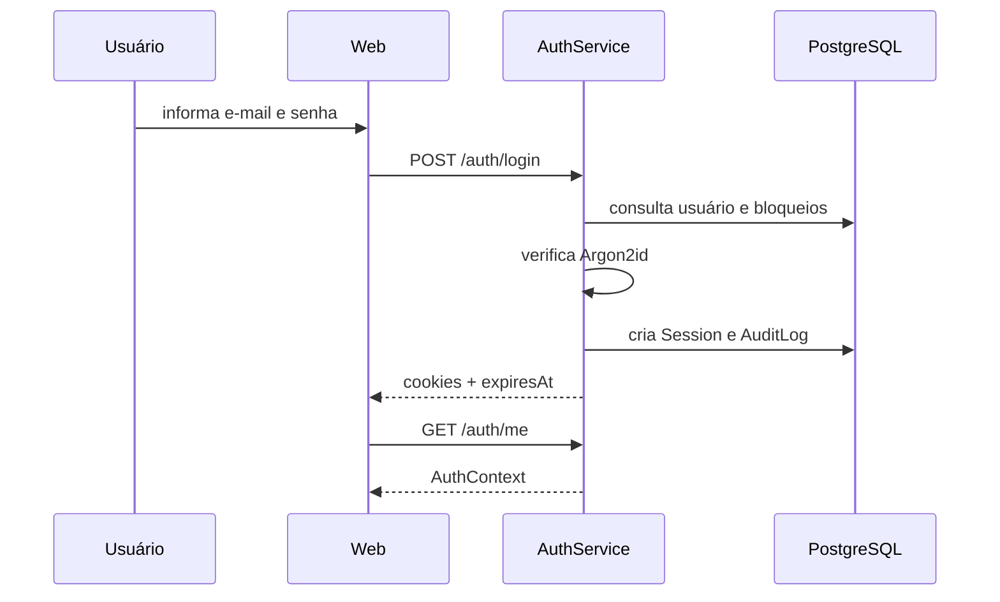
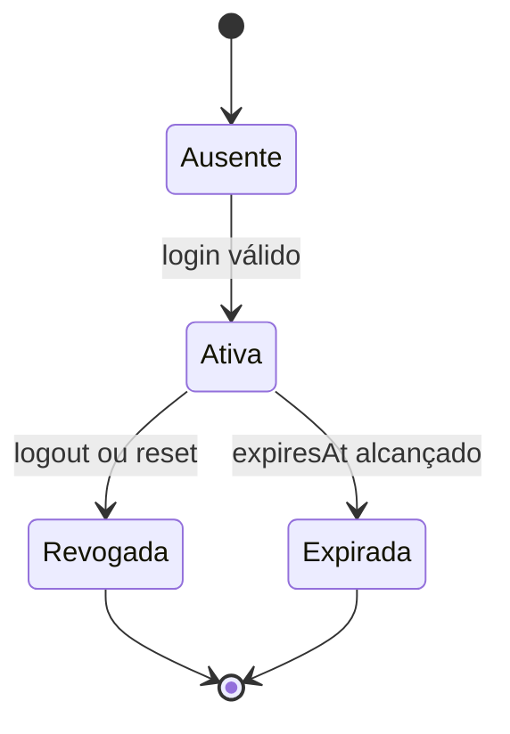

# Login e sessões — Design

## Interface

- `POST /api/v1/auth/login` recebe e-mail e senha e grava cookies com a validade da sessão. **[CONFIRMADO]**
- `POST /api/v1/auth/logout` revoga a sessão referenciada pelo cookie atual. **[CONFIRMADO]**
- `GET /api/v1/auth/me` retorna o contexto usado pela web para montar navegação e permissões. **[CONFIRMADO]**

## Sequência principal

**[CONFIRMADO]**

## Proteções

- `authCookieOptions` centraliza domínio implícito, caminho, `SameSite`, segurança e expiração. **[CONFIRMADO]**
- O cookie de sessão é `HttpOnly`; o cookie CSRF é legível para formar `X-CSRF-Token`. **[CONFIRMADO]**
- O guard rejeita sessão ausente, revogada, expirada ou de usuário inativo. **[CONFIRMADO]**
- O cache possui TTL próprio e não substitui a expiração do registro persistido. **[CONFIRMADO]**

## Estados

**[CONFIRMADO]**

## Alternativas descartadas

- Persistir JWT de usuário em `localStorage` foi evitado; a implementação usa sessão/cookie e CSRF. **[CONFIRMADO]**
- Renovação silenciosa por refresh token separado não aparece no código analisado. **[CONFIRMADO]**

## Falhas e observabilidade

- Falhas de credencial incrementam a proteção contra tentativas; sucesso limpa ou encerra a sequência aplicável. **[CONFIRMADO]**
- Erros devem preservar respostas genéricas sem registrar senha ou token. **[INFERIDO]**
- A ausência de métricas de cache e bloqueio é uma lacuna operacional a validar. **[A VALIDAR]**

## Referências

`apps/api/src/auth/auth.controller.ts`, `auth.service.ts`, `auth.guard.ts`, `auth-cache.service.ts` e `auth-cookies.ts`; a validação CSRF está no próprio `auth.guard.ts`. **[CONFIRMADO]**
