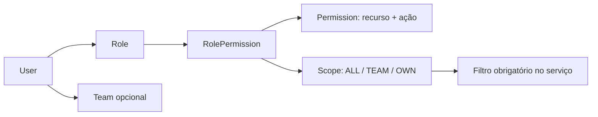

# Usuários e papéis — Design

## Componentes e interface

`UsersController` separa rotas de autogerenciamento das rotas protegidas por `RequirePermission`; `UsersService` aplica as invariantes e grava auditoria. **[CONFIRMADO]**

| Operação | Rota | Guarda |
|---|---|---|
| Listar usuários | `GET /api/v1/users` | `users:read` **[CONFIRMADO]** |
| Consultar metadados | `GET /api/v1/users/metadata` | sessão autenticada **[CONFIRMADO]** |
| Atualizar perfil | `PATCH /api/v1/users/me` | próprio usuário **[CONFIRMADO]** |
| Atualizar assinatura | `PATCH /api/v1/users/me/preferences` | próprio usuário **[CONFIRMADO]** |
| Associar/remover foto | `PATCH/DELETE /api/v1/users/me/profile-photo` | próprio usuário **[CONFIRMADO]** |
| Editar/desativar membro | `PATCH/DELETE /api/v1/users/:id` | `users:write` **[CONFIRMADO]** |
| Substituir permissões | `PUT /api/v1/users/roles/:id/permissions` | `users:write` **[CONFIRMADO]** |

## Modelo de autorização

**[CONFIRMADO]**

O guard decide se a ação é permitida; os serviços aplicam o escopo aos registros consultados ou alterados. **[CONFIRMADO]**

## Foto e mídia

O perfil referencia um `MediaAsset` já autorizado; a leitura não expõe credenciais do bucket e redireciona para URL temporária com cache privado. **[CONFIRMADO]**

## Decisões e riscos

- Substituir a coleção de permissões simplifica a edição administrativa, mas exige transação para não deixar o papel parcialmente atualizado. **[INFERIDO]**
- Uma interface ocultar ação sem permissão melhora usabilidade, porém nunca substitui os guards e filtros da API. **[CONFIRMADO]**
- Reatribuir ou desativar o último administrador pode causar bloqueio operacional; a proteção exata deve permanecer coberta por testes do serviço. **[CONFIRMADO]**

## Observabilidade

Mudanças de usuário e permissão geram auditoria com ator, entidade e metadados; fotos são rastreadas pelo ativo de mídia associado. **[CONFIRMADO]**

## Referências

`apps/api/src/users/users.controller.ts`, `users.service.ts`, `apps/api/src/auth/permission.guard.ts`, `permission.decorator.ts`, `packages/database/prisma/schema.prisma`. **[CONFIRMADO]**
