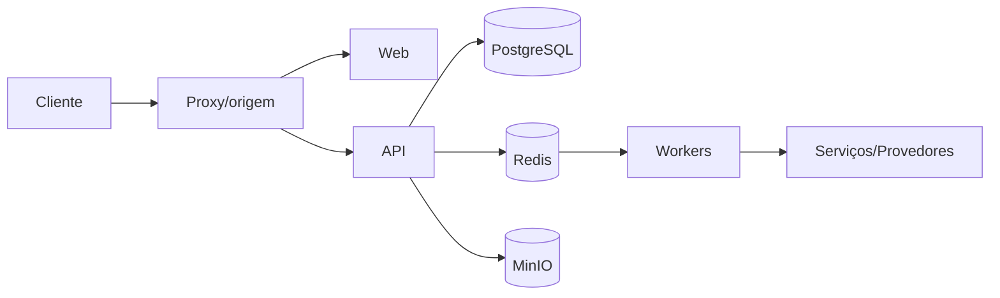

# Infraestrutura e implantação — Design

## Estrutura

- O frontend consome uma origem configurável e delega autenticação e autorização à API. **[CONFIRMADO]**
- Serviços internos comunicam-se por rede Docker e nomes de serviço. **[CONFIRMADO]**
- PostgreSQL persiste domínio; Redis coordena cache/filas; MinIO persiste objetos. **[CONFIRMADO]**
- Processos especializados permanecem isolados para permitir evolução e falha parcial. **[CONFIRMADO]**

## Interfaces

- `HTTP/HTTPS web e /api via Caddy/Nginx`. **[CONFIRMADO]**
- `MCP interno :3100`. **[CONFIRMADO]**
- `Evolution interno :8080`. **[CONFIRMADO]**
- `PostgreSQL :5432 interno`. **[CONFIRMADO]**
- `Redis :6379 interno`. **[CONFIRMADO]**
- `MinIO :9000 interno/loopback configurável`. **[CONFIRMADO]**
- `Speaches interno :8000`. **[CONFIRMADO]**

## Fluxo

**[CONFIRMADO]**

## Decisões

- As fronteiras são configuradas por ambiente para permitir localhost, LAN e produção sem alterar domínio. **[CONFIRMADO]**
- Efeitos demorados ficam fora do request HTTP e usam estado persistente. **[CONFIRMADO]**
- Segurança é aplicada no backend e na rede; controles visuais são apenas apoio. **[CONFIRMADO]**

## Observabilidade e riscos

- Healthchecks devem distinguir dependência obrigatória de recurso opcional. **[INFERIDO]**
- Ausência de CI automatizado aumenta o risco de implantação de build não validado. **[CONFIRMADO]**
- Configuração divergente entre Compose, proxy e .env pode produzir links incorretos ou serviços inacessíveis. **[CONFIRMADO]**

## Referências

`docker-compose.yml`, `docker-compose.tailscale.yml`, `Caddyfile`, `apps/web/nginx.conf`, `rebuild.sh`, `scripts/backup.sh`, `.env.example`, `README.md`. **[CONFIRMADO]**
