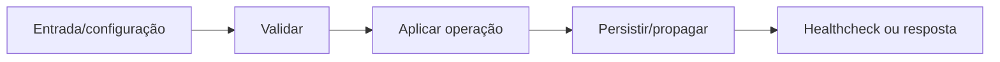

# Proxy e redes — Design

## Fluxo

Cliente/Tailscale → Caddy ou Nginx → web/API/socket/media → serviços internos **[CONFIRMADO]**

**[INFERIDO]**

## Falhas e segurança

- Falha obrigatória interrompe o fluxo antes de expor estado inconsistente. **[INFERIDO]**
- Valores secretos são redigidos em logs e não entram no frontend. **[CONFIRMADO]**
- Reexecução deve ser segura ou exigir confirmação explícita quando houver efeito externo. **[INFERIDO]**

## Referências

`Caddyfile`, `docker-compose.tailscale.yml`, `apps/web/nginx.conf`, `apps/web/vite.config.ts`. **[CONFIRMADO]**
