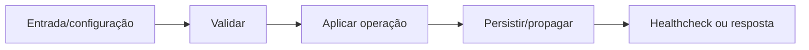

# Interações complexas — Design

## Fluxo

Interação local → estado transitório → mutação API → confirmação Socket/HTTP ou rollback + toast **[CONFIRMADO]**

**[INFERIDO]**

## Falhas e segurança

- Falha obrigatória interrompe o fluxo antes de expor estado inconsistente. **[INFERIDO]**
- Valores secretos são redigidos em logs e não entram no frontend. **[CONFIRMADO]**
- Reexecução deve ser segura ou exigir confirmação explícita quando houver efeito externo. **[INFERIDO]**

## Referências

`apps/web/src/pages/Inbox.tsx`, `apps/web/src/pages/Pipeline.tsx`, `apps/web/src/pages/Tasks.tsx`, `apps/web/src/components`. **[CONFIRMADO]**
