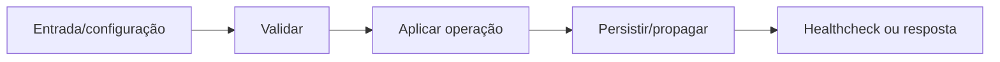

# Tema e movimento — Design

## Fluxo

Preferência de tema/movimento → tokens CSS → componentes → transições reduzidas quando solicitado **[CONFIRMADO]**

**[INFERIDO]**

## Falhas e segurança

- Falha obrigatória interrompe o fluxo antes de expor estado inconsistente. **[INFERIDO]**
- Valores secretos são redigidos em logs e não entram no frontend. **[CONFIRMADO]**
- Reexecução deve ser segura ou exigir confirmação explícita quando houver efeito externo. **[INFERIDO]**

## Referências

`apps/web/src/styles.css`, `apps/web/src/interface-v2.css`, `apps/web/src/interface-components.css`, `apps/web/src/apple-ui.css`. **[CONFIRMADO]**
