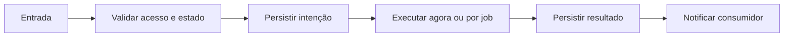

# Upload e download — Design

## Fluxo

Arquivo → multipart API → validação → MinIO + MediaAsset → URL assinada sob demanda **[CONFIRMADO]**

**[INFERIDO]**

## Falhas e retomada

- Entrada inválida falha antes do efeito. **[CONFIRMADO]**
- Falha de dependência mantém motivo sanitizado e segue retry delimitado. **[CONFIRMADO]**
- Reinício recupera pelo banco e não pela memória do processo. **[CONFIRMADO]**
- Resultado obsoleto não substitui estado mais recente. **[INFERIDO]**

## Referências

`apps/api/src/media/media.controller.ts`, `apps/api/src/media/media.service.ts`, `apps/web/src/pages/Inbox.tsx`. **[CONFIRMADO]**
