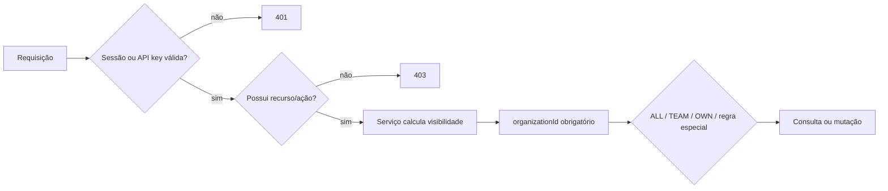

# Permissões, escopos e visibilidade — BZS One

> Matriz retroativa em 2026-08-21.  
> 🟢 confirmado; 🟡 inferido; 🔴 lacuna.

## 1. Modelo de autorização

Uma permissão possui três dimensões:

```text
recurso : ação : escopo
```

- **Recurso**: `companies`, `contacts`, `opportunities`, `tasks`, `conversations`, `campaigns`, `workflows`, `reports`, `users`, `integrations`, `api_keys` ou `webhooks`.
- **Ação**: em geral `read` ou `write`; campanhas também usam `launch`.
- **Escopo**: `ALL`, `TEAM` ou `OWN`.
- `*` em recurso/ação funciona como wildcard. 🟢

O `AuthGuard` autentica e valida recurso/ação. A filtragem por escopo é responsabilidade dos serviços, por `scopedWhere`, `permissionScope` ou regra especializada. Portanto, decorar um endpoint não basta para restringir linhas do banco. 🟢



## 2. Autenticação e credenciais

| Credencial | Verificação | Proteções | Confiança |
|---|---|---|---|
| Sessão web | JWT assinado + sessão persistida por hash | usuário `ACTIVE`, expiração, cache invalidável, cookie seguro, CSRF em mutações por cookie | 🟢 |
| Bearer de sessão | mesmo JWT | não depende de CSRF por não usar cookie implícito | 🟢 |
| Chave de API | token `pk_…` comparado por SHA-256 | expiração, revogação, escopos, cache, atualização de último uso | 🟢 |
| Webhook Evolution/Mailgun | rota pública específica | validação/assinatura conforme provedor e processamento idempotente | 🟢 |
| MCP | chave de API repassada ao adaptador | ferramentas anunciadas conforme escopos; API REST continua autorizando | 🟢 |

Quando uma sessão está ausente, inválida ou expirada, a API limpa os cookies de autenticação. A interface centraliza `401` e retorna ao login, inclusive em abas diferentes. 🟢

## 3. Semântica dos escopos genéricos

| Escopo | Filtro padrão | Condição sem responsável/equipe | Confiança |
|---|---|---|---|
| `ALL` | sem filtro adicional além de organização | vê todos da organização | 🟢 |
| `TEAM` | `teamId = auth.teamId` | sem equipe, força consulta vazia | 🟢 |
| `OWN` | `ownerId = auth.userId` | sem usuário, força consulta vazia | 🟢 |

O escopo ausente cai em `OWN`. O primeiro item compatível encontrado em `auth.permissions` determina o escopo. 🟢

> 🟡 **Risco de ordem:** em papel customizado com wildcard e regra específica conflitantes, `Array.find` torna a ordem persistida relevante. Não existe precedência explícita “mais específico vence”.

## 4. Papéis padrão do seed

### 4.1 Administrador

| Recursos | Ações | Escopo |
|---|---|---|
| todos (`*`) | todas (`*`) | `ALL` |

O papel Administrador deve preservar `*:*:ALL`; a interface impede remover essa capacidade do papel de sistema. Configuração global de IA exige também `roleKey = admin`, não apenas uma permissão equivalente. 🟢

### 4.2 Gestor

| Recurso | Ações | Escopo |
|---|---|---|
| empresas | todas | equipe |
| contatos | todas | equipe |
| oportunidades | todas | equipe |
| tarefas | todas | equipe |
| conversas | todas | equipe, com regra especial do Inbox |
| campanhas | todas, incluindo lançar | equipe |
| workflows/chatbots | todas | equipe |
| relatórios | leitura | equipe |
| usuários | leitura | equipe funcionalmente limitada pelo serviço | 

Não recebe por padrão `integrations`, `api_keys` ou `webhooks`. 🟢

### 4.3 SDR

| Recurso | Ações | Escopo |
|---|---|---|
| empresas | leitura | equipe |
| empresas | escrita | próprios |
| contatos | todas | equipe |
| oportunidades | todas | próprios |
| tarefas | todas | próprios |
| conversas | todas | equipe, com regra especial do Inbox |
| campanhas | ler, escrever e lançar | equipe |

Não recebe por padrão workflows/chatbots, relatórios, usuários, integrações, chaves ou webhooks. 🟢

### 4.4 Vendedor

| Recurso | Ações | Escopo |
|---|---|---|
| empresas | leitura | equipe |
| contatos | leitura | equipe |
| oportunidades | todas | próprios |
| tarefas | todas | próprios |
| conversas | todas | próprios, com regra especial do Inbox |
| relatórios | leitura | próprios |

Não recebe por padrão escrita de contatos/empresas, campanhas, workflows/chatbots, usuários ou integrações. 🟢

## 5. Matriz de capacidades por superfície

| Superfície | Ler | Alterar/criar | Operação especial | Observação |
|---|---|---|---|---|
| Empresas | `companies:read` | `companies:write` | mesclar/importar/logo usam escrita | aplica escopo genérico |
| Contatos | `contacts:read` | `contacts:write` | mesclar/importar/bloquear campanha usam escrita | aplica escopo genérico e deduplicação |
| Oportunidades/funis | `opportunities:read` | `opportunities:write` | mover etapa/proposta usam escrita | aplica escopo genérico |
| Tarefas | `tasks:read` | `tasks:write` | concluir/cancelar/reagendar usam escrita | filtro próprio equivalente a ALL/TEAM/OWN |
| Conversas | `conversations:read` | `conversations:write` | assumir, transferir, enviar, fixar, exportar | usa visibilidade especializada |
| Campanhas | `campaigns:read` | `campaigns:write` | `campaigns:launch` inicia/retoma | audiência ainda respeita contatos visíveis |
| Workflows | `workflows:read` | `workflows:write` | publicar/pausar/arquivar e iniciar manualmente | escopo próprio por autor/equipe |
| Chatbots | `workflows:read` | `workflows:write` | publicar/pausar/arquivar | compartilha recurso de workflows |
| Respostas rápidas | `conversations:read` | `conversations:write` | criar/editar/excluir | recurso compartilhado com Inbox |
| Follow-up | `conversations:read` | `conversations:write` | criar também exige `tasks:write`; modo workflow exige `workflows:write` | conversa precisa estar visível |
| IA da conversa | `conversations:read` | `conversations:write` | gerar/repetir/aplicar proposta | respeita visibilidade da conversa |
| Configuração global de IA | — | administrador | testar e gerir RAG/configuração | checagem explícita `roleKey` |
| Conexões WhatsApp | `integrations:read` | `integrations:write` | conectar, QR, desconectar, excluir | escopo filtra equipe/autor conforme operação |
| Relatórios | `reports:read` | — | exportar PDF | parte dos agregados usa escopos dos objetos |
| Modelos/campanhas de e-mail | `campaigns:read` | `campaigns:write` | iniciar campanha usa `campaigns:launch` | Gmail só para campanhas manuais |
| Usuários/equipes/papéis | `users:read` | `users:write` | convite, edição, suspensão, reset | administrador protegido |
| Chaves de API | — | `api_keys:write` | criar/revogar | segredo exibido apenas na criação |
| Webhooks externos | `webhooks:read` | `webhooks:write` | criar/editar/excluir | endpoint precisa passar anti-SSRF |
| MCP | conforme chave | conforme chave | sem operações destrutivas | apenas rotas públicas permitidas |

## 6. Visibilidade especial de conversas

Conversas não usam diretamente `ownerId/teamId`. A regra confirmada é:

| Usuário | Visão padrão | Com “ver todos” |
|---|---|---|
| Administrador | atribuídas a ele + sem responsável | todas da organização |
| Não admin com equipe | atribuídas a ele + sem responsável em instâncias ligadas à equipe | sem ampliação |
| Não admin sem equipe | somente atribuídas a ele | sem ampliação |
| API key | não possui `userId`; visibilidade fica vazia para Inbox | não aplicável |

Consequências:

1. `conversations:*:TEAM` não permite ver tickets atribuídos a colegas; equipe só amplia a fila sem responsável. 🟢
2. O administrador também não recebe automaticamente o histórico de todos na consulta padrão; precisa ativar `requestAll`. 🟢
3. Assumir uma conversa atribuída a outro usuário é bloqueado para não administradores. 🟢
4. Transferir exige destinatário ativo e, para não administradores, compatibilidade com a equipe permitida. 🟢
5. Acesso direto por ID reutiliza a mesma cláusula, impedindo contornar a lista pela API. 🟢

## 7. Chaves de API e MCP

### 7.1 Fronteira da API pública

Mesmo com escopo válido, uma chave `pk_` só pode acessar caminhos sob:

```text
/api/v1/companies
/api/v1/contacts
/api/v1/opportunities
/api/v1/pipelines
/api/v1/tasks
/api/v1/tags
/api/v1/custom-fields
/api/v1/segments
/api/v1/mcp
```

Conectar números, acessar conversas, enviar mensagens, iniciar campanhas, configurar IA ou administrar usuários não faz parte da API pública atual. 🟢

### 7.2 Escopos

A chave transforma cada string `recurso:ação` em permissão com escopo `ALL`, sempre limitada à organização da chave e à whitelist de rotas. Expiração/revogação invalida a autenticação. 🟢

### 7.3 MCP

- O MCP anuncia somente ferramentas cujos recursos/ações aparecem nos escopos da chave. 🟢
- Ferramentas disponíveis cobrem listar/obter/criar/editar CRM e concluir tarefa; não há exclusão, arquivamento, cancelamento ou envio de mensagem. 🟢
- As ferramentas chamam a API, não o Prisma; autorização e idempotência permanecem centralizadas. 🟢
- Anotações MCP distinguem leitura, criação e atualização para consumidores. 🟢

## 8. Permissões compostas e regras adicionais

| Operação | Permissões/circunstâncias adicionais | Confiança |
|---|---|---|
| Agendar follow-up de mensagens | `conversations:write` + `tasks:write` | 🟢 |
| Agendar follow-up de automação | anteriores + `workflows:write` | 🟢 |
| Iniciar campanha | `campaigns:launch`; editar rascunho sozinho não basta | 🟢 |
| Aplicar proposta da IA | conversa gravável e permissões dos serviços de CRM afetados | 🟢 |
| Configurar IA/OpenAI/RAG | administrador, mesmo se papel customizado tiver integração | 🟢 |
| Ver todas as conversas | administrador + parâmetro explícito | 🟢 |
| Fixar conversa | usuário autenticado, conversa visível e `OPEN` | 🟢 |
| Trocar conexão de conversa | `conversations:write`; ação só aparece se conexão anterior está indisponível/excluída e exige confirmação | 🟢 |
| Editar/excluir mensagem | outbound, conversa visível e regras do provedor; áudio não oferece copiar | 🟢 |
| Deletar recurso pelo MCP | nunca anunciado/permitido | 🟢 |

## 9. Interface versus segurança

- O frontend usa as permissões retornadas por `/auth/me` para ocultar/desabilitar controles e menus. 🟢
- Isso é apenas experiência do usuário. O `AuthGuard`, filtros por organização e escopo no serviço são a fronteira de segurança. 🟢
- Respostas `401` globais encerram o estado autenticado e impedem que uma aba continue exibindo dados como se a sessão fosse válida. 🟢
- Socket.IO distribui apenas eventos associados à organização/usuário; o cliente ainda revalida dados pela API. 🟡

## 10. Pontos em que o escopo não é uniforme

1. **Conversas:** usam responsabilidade/fila/instância, não `scopedWhere`. 🟢
2. **Usuários:** o endpoint exige `users:read`, mas listagens administrativas trabalham primariamente por organização; `TEAM` do papel Gestor não se traduz em todos os métodos como filtro genérico `teamId`. 🟢
3. **Integrações:** o escopo define acesso a instâncias/equipes por lógica própria, não `ownerId` puro. 🟢
4. **Relatórios:** oportunidades, empresas e tarefas aplicam escopo de objeto, mas alguns agregados de campanhas/conversas são organizacionais. A etiqueta `reports:read:OWN/TEAM` não garante granularidade idêntica para toda métrica. 🟢
5. **Configurações globais:** são deliberadamente organizacionais e, em IA, exclusivas de admin. 🟢

## 11. Lacunas e riscos

1. 🟡 A resolução “primeira permissão compatível” pode produzir escopo inesperado em papéis customizados com regras sobrepostas.
2. 🔴 Não existe teste matricial único cobrindo cada endpoint × papel × escopo; os testes estão distribuídos por serviço.
3. 🟡 O conjunto de recursos é string livre no banco. Um erro de digitação cria permissão inócua, sem catálogo referencial.
4. 🟡 Alguns recursos compartilham permissão (`chatbots` com `workflows`, respostas rápidas com `conversations`), o que reduz granularidade administrativa.
5. 🔴 Não há permissão separada para visualizar dados sensíveis de IA/RAG sem poder alterar a configuração global; atualmente o admin concentra essa capacidade.
6. 🟡 Escopos de relatórios deveriam ser formalizados métrica por métrica antes de expor relatórios a mais papéis customizados.

## 12. Evidências principais

- `apps/api/src/auth/auth.guard.ts`
- `apps/api/src/auth/data-scope.ts`
- `apps/api/src/auth/permission.decorator.ts`
- `apps/api/src/integrations/conversation-visibility.ts`
- `apps/api/src/integrations/evolution.service.ts`
- `apps/api/src/crm/crm.service.ts`
- `apps/api/src/campaigns/campaigns.service.ts`
- `apps/api/src/follow-ups/follow-ups.service.ts`
- `apps/api/src/ai/ai.service.ts`
- `apps/api/src/reports/reports.service.ts`
- `apps/api/src/users/users.service.ts`
- `apps/mcp/src/tools.ts`
- `apps/mcp/src/tools.test.ts`
- `packages/database/prisma/seed.ts`
