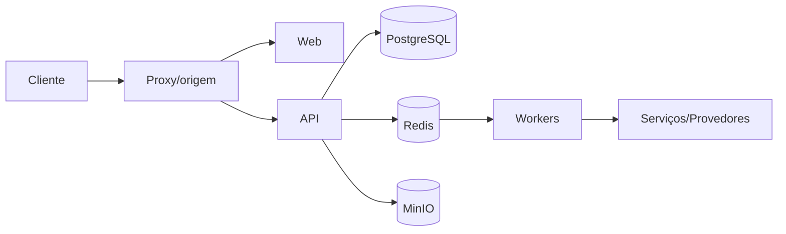

# Plataforma assíncrona — Design

## Estrutura

- O frontend consome uma origem configurável e delega autenticação e autorização à API. **[CONFIRMADO]**
- Serviços internos comunicam-se por rede Docker e nomes de serviço. **[CONFIRMADO]**
- PostgreSQL persiste domínio; Redis coordena cache/filas; MinIO persiste objetos. **[CONFIRMADO]**
- Processos especializados permanecem isolados para permitir evolução e falha parcial. **[CONFIRMADO]**

## Interfaces

- `BullMQ campaign`. **[CONFIRMADO]**
- `BullMQ inbound`. **[CONFIRMADO]**
- `BullMQ workflows`. **[CONFIRMADO]**
- `BullMQ chatbots`. **[CONFIRMADO]**
- `BullMQ follow-ups`. **[CONFIRMADO]**
- `BullMQ ai-generations`. **[CONFIRMADO]**
- `BullMQ transcription`. **[CONFIRMADO]**
- `BullMQ external-webhooks`. **[CONFIRMADO]**

## Fluxo

**[CONFIRMADO]**

## Decisões

- As fronteiras são configuradas por ambiente para permitir localhost, LAN e produção sem alterar domínio. **[CONFIRMADO]**
- Efeitos demorados ficam fora do request HTTP e usam estado persistente. **[CONFIRMADO]**
- Segurança é aplicada no backend e na rede; controles visuais são apenas apoio. **[CONFIRMADO]**

## Observabilidade e riscos

- Healthchecks devem distinguir dependência obrigatória de recurso opcional. **[INFERIDO]**
- Ausência de CI automatizado aumenta o risco de implantação de build não validado. **[CONFIRMADO]**
- Configuração divergente entre Compose, proxy e .env pode produzir links incorretos ou serviços inacessíveis. **[CONFIRMADO]**

## Referências

`apps/worker/src/main.ts`, `apps/worker/src/queue.ts`, `apps/worker/src/redis.ts`, `apps/worker/src/maintenance.processor.ts`, `apps/api/src/queue/queue.service.ts`, `docker-compose.yml`. **[CONFIRMADO]**
