# Máquinas de estado — BZS One

> Estados reconstruídos do schema, serviços e testes em 2026-08-21.  
> 🟢 confirmado; 🟡 inferido; 🔴 lacuna.

## 1. Usuário

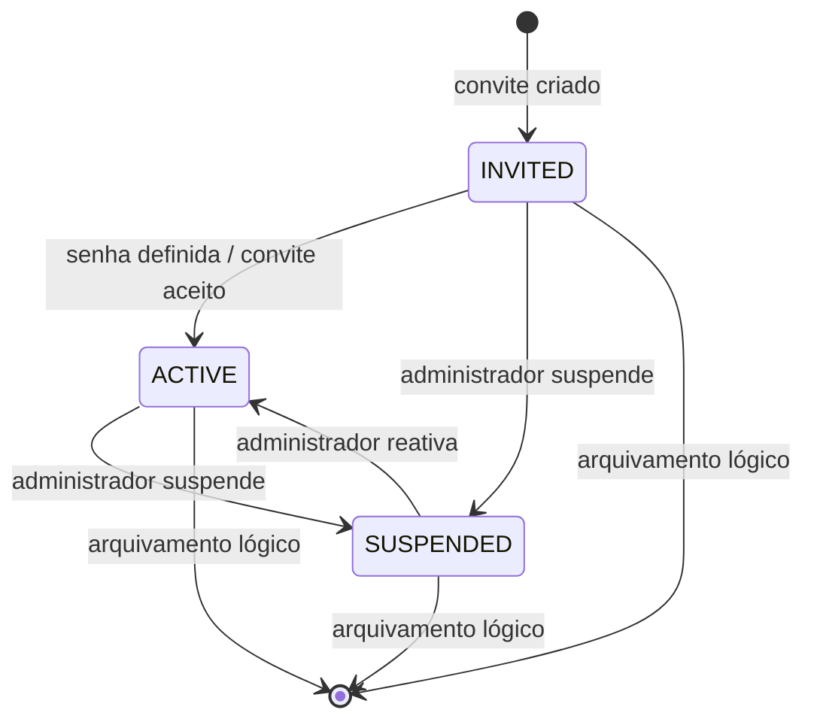

| Origem | Destino | Gatilho / guarda | Efeitos | Confiança |
|---|---|---|---|---|
| inexistente | `INVITED` | criação de usuário sem ativação imediata | token de convite; e-mail transacional pendente | 🟢 |
| `INVITED` | `ACTIVE` | aceite com token válido e senha mínima | invalida convite e permite sessão | 🟢 |
| `ACTIVE`/`INVITED` | `SUSPENDED` | alteração administrativa | sessões deixam de autenticar | 🟢 |
| `SUSPENDED` | `ACTIVE` | reativação administrativa | login volta a ser elegível | 🟢 |
| qualquer | arquivado | exclusão lógica | conversas abertas são devolvidas à fila e tarefas/follow-ups são ajustados | 🟢 |

`InviteEmailStatus` e `TaskDigestStatus` possuem máquinas auxiliares simples `PENDING → SENT | FAILED`, com nova tentativa operada pela fila/provedor. 🟢

## 2. Instância WhatsApp

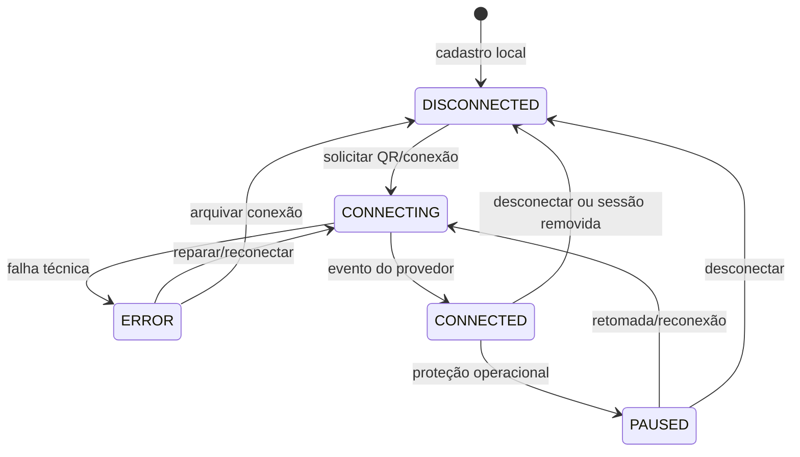

- O estado é por instância; eventos de uma conexão não podem atualizar outra apenas por nome ou organização. 🟢
- Exclusão local é lógica e tenta remover a sessão remota; falha remota não impede o arquivamento local. 🟢
- `PAUSED` representa bloqueio operacional, inclusive proteção de campanha; não equivale a desconexão física. 🟢
- 🔴 Não há diagrama formal do provedor que garanta quais sequências intermediárias a Evolution pode emitir; o código normaliza o observado.

## 3. Conversa / atendimento

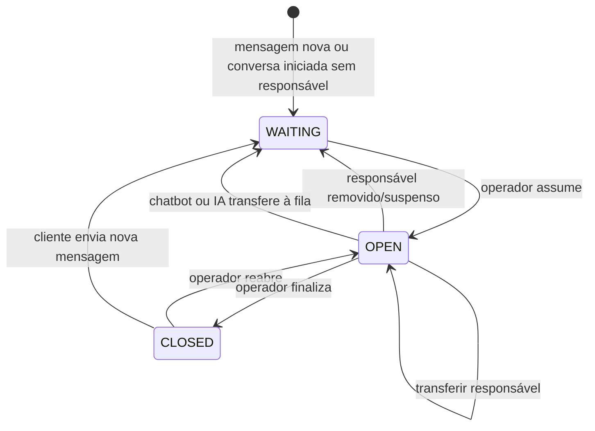

| Origem | Destino | Gatilho / guarda | Efeitos | Confiança |
|---|---|---|---|---|
| inexistente | `WAITING` | inbound desconhecido ou novo ticket sem operador | cria/associa contato e conversa | 🟢 |
| `WAITING` | `OPEN` | assumir | `assigneeId = usuário atual`; evento interno | 🟢 |
| `CLOSED` | `OPEN` | reabrir manualmente | responsável passa a ser o usuário atual; `closedAt = null` | 🟢 |
| `OPEN` | `OPEN` | transferir | troca responsável e propaga para follow-up/tarefa elegíveis | 🟢 |
| `OPEN` | `CLOSED` | finalizar | mantém responsável; interrompe chatbot/IA incompatíveis; registra `closedAt` | 🟢 |
| `CLOSED` | `WAITING` | nova mensagem do cliente | limpa responsável e inicia novo atendimento | 🟢 |
| `OPEN` | `WAITING` | responsável é excluído/suspenso | limpa responsável para não deixar ticket invisível | 🟢 |

Regras laterais:

- Fixação não altera o estado e só é permitida em `OPEN`. 🟢
- Selecionar uma conversa na interface não muda o estado; assumir é ação explícita. 🟢
- Exportação PDF delimita o último atendimento pelos eventos de início/reabertura, não todo o histórico da conversa. 🟢

## 4. Mensagem

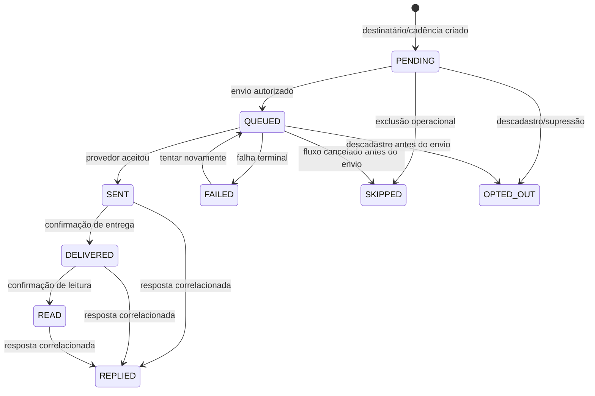

| Estado | Semântica | Terminal para cadência? | Confiança |
|---|---|---:|---|
| `PENDING` | planejada, ainda sem job efetivo | não | 🟢 |
| `QUEUED` | persistida e elegível ao worker | não | 🟢 |
| `SENT` | aceita pelo provedor | sim para envio; pode evoluir entrega | 🟢 |
| `DELIVERED` | entregue no dispositivo | sim | 🟢 |
| `READ` | lida pelo destinatário | sim | 🟢 |
| `REPLIED` | resposta correlacionada | sim | 🟢 |
| `FAILED` | falha registrada | sim, salvo retry explícito | 🟢 |
| `SKIPPED` | não enviada por regra/cancelamento | sim | 🟢 |
| `OPTED_OUT` | não enviada por descadastro | sim | 🟢 |

- Inbound pode ser persistida diretamente com estado compatível com o evento recebido; a sequência acima descreve principalmente outbound. 🟢
- Edição, reação e exclusão são dimensões paralelas: não substituem o estado de entrega. Mensagem apagada preserva o texto e recebe indicador próprio. 🟢
- Atualizações do provedor são idempotentes por IDs de evento/mensagem; regressão de estado de entrega não deve prevalecer sobre confirmação mais avançada. 🟢

## 5. Oportunidade e tarefa

### Oportunidade

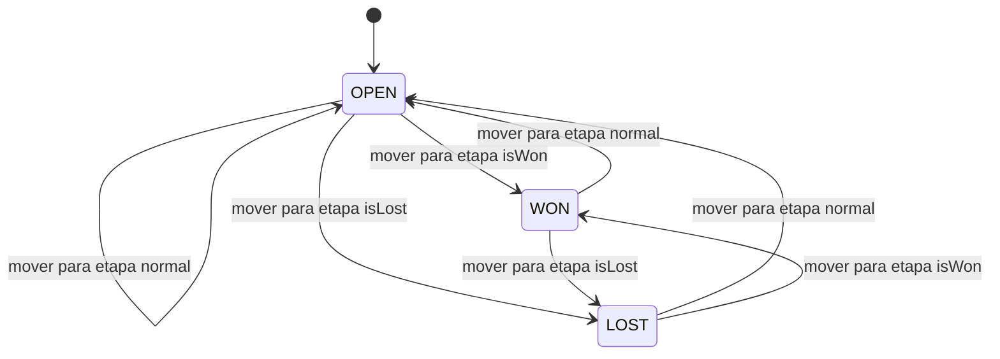

O estado é derivado da etapa selecionada, portanto a movimentação do Kanban é a operação canônica. A probabilidade também pode acompanhar a etapa. 🟢

### Tarefa

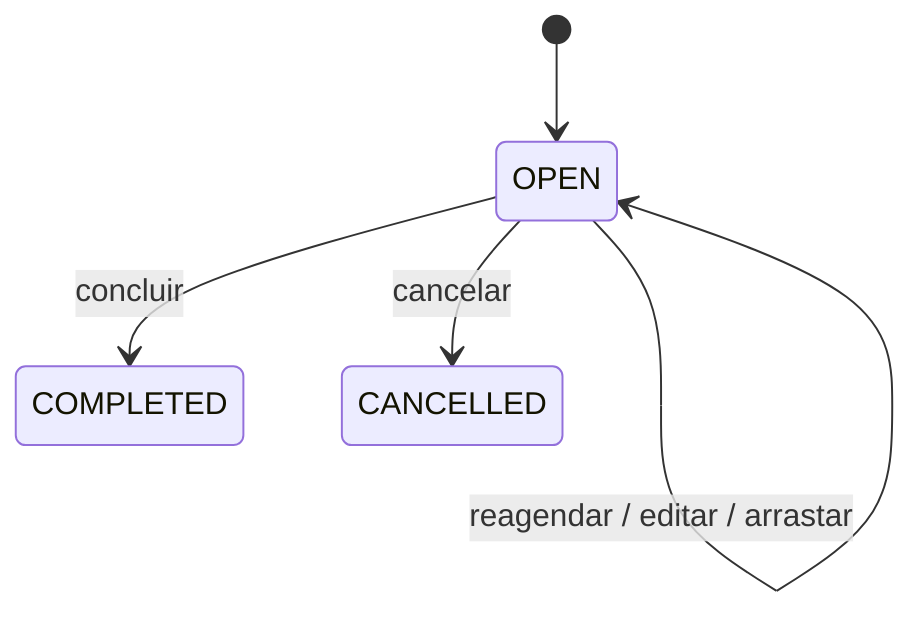

- Não foi encontrado fluxo de reabertura de tarefa concluída/cancelada. 🟢
- Quando vinculada a follow-up, conclusão/cancelamento manual também cancela o agendamento ainda não executado. 🟢
- Tarefa de follow-up pode permanecer `OPEN` e vencida quando o disparo falha após a tolerância. 🟢

## 6. Campanha e destinatário

### Campanha

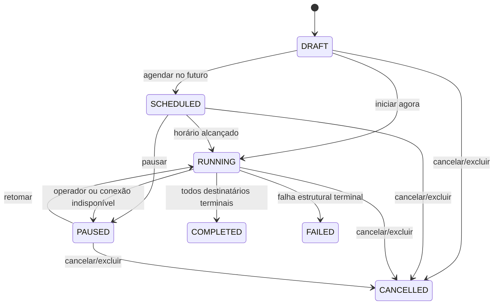

| Transição | Guarda / observação | Confiança |
|---|---|---|
| `DRAFT → SCHEDULED/RUNNING` | exige `campaigns:launch`, configuração e pré-validação | 🟢 |
| `SCHEDULED → RUNNING` | job atrasado revalida estado antes de consumir | 🟢 |
| `RUNNING → PAUSED` | ação manual ou conexão WhatsApp desconectada | 🟢 |
| `PAUSED → RUNNING` | recria/retoma jobs pendentes | 🟢 |
| `RUNNING → COMPLETED` | nenhuma entrega `PENDING`/`QUEUED` restante; ignorados contam como terminais | 🟢 |
| ativo → `CANCELLED` | destinatários ainda pendentes/enfileirados viram `SKIPPED` | 🟢 |
| `RUNNING → FAILED` | configuração/conteúdo inválido ou falha terminal de campanha | 🟢 |

### Destinatário

O destinatário reutiliza `MessageStatus`. O percurso típico é `PENDING → QUEUED → SENT → DELIVERED/READ/REPLIED`; exclusões resultam em `SKIPPED` ou `OPTED_OUT`, e falhas em `FAILED`. 🟢

## 7. Workflow e inscrição

### Definição

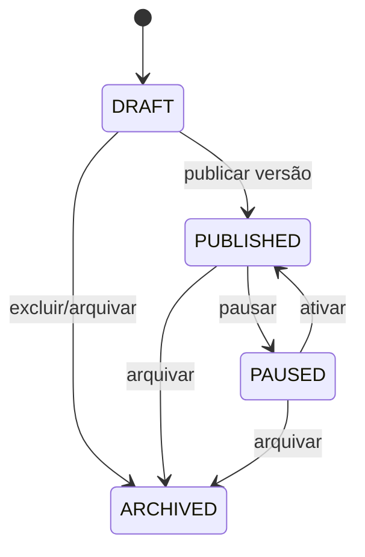

Publicar marca a versão corrente como imutável e atualiza `publishedVersion`. Para modificar, salva-se nova versão. 🟢

### Inscrição

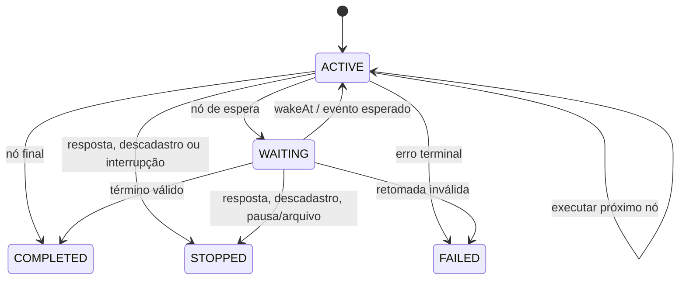

- `wakeAt` é persistido; um job perdido é recriado pelo reconciliador. 🟢
- Inscrição manual é vinculada ao contato; iniciar novamente cria nova execução em vez de bloquear por versão. 🟢
- Descadastro/perda de consentimento interrompe ações futuras. 🟢

## 8. Chatbot e sessão

### Definição

O chatbot segue `DRAFT → PUBLISHED ↔ PAUSED → ARCHIVED`, com a mesma regra de versão imutável do workflow. Publicar exige versão ainda não publicada; pausar/arquivar encerra sessões elegíveis. 🟢

### Sessão

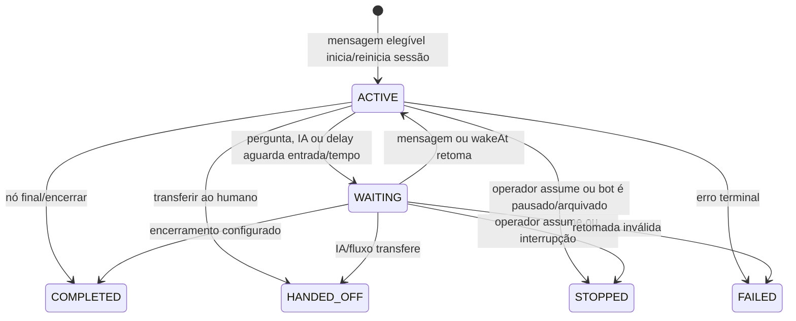

- O grafo permite ciclos; a sessão controla nó atual, contexto e última mensagem para evitar repetição indevida. 🟢
- Mensagem mais recente pode cancelar geração de IA anterior e substituir a entrada ainda pendente. 🟢
- Handoff coloca a conversa em `WAITING` e limpa o responsável; atribuição humana produz `STOPPED`, não `HANDED_OFF`. 🟢

## 9. Follow-up e etapas

### Follow-up

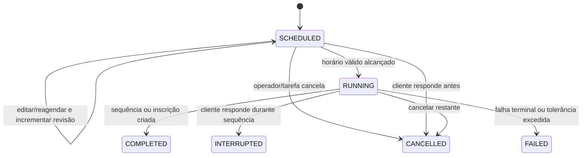

### Etapa de mensagem

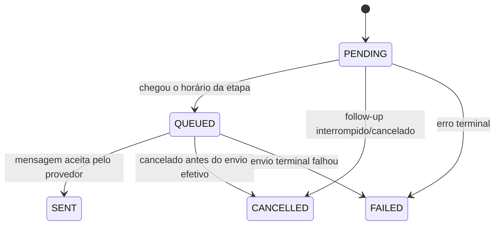

| Regra | Resultado | Confiança |
|---|---|---|
| job com revisão antiga | sai sem enviar | 🟢 |
| servidor retorna dentro de 30 min | reconciliador executa | 🟢 |
| atraso maior que tolerância | `FAILED`, sem envio inesperado | 🟢 |
| conexão temporariamente indisponível | retry de um minuto até limite | 🟢 |
| etapa enviada | agenda a seguinte a partir do sucesso | 🟢 |
| modo workflow | conclui ao criar a inscrição na versão fixada | 🟢 |

## 10. Geração de IA e proposta

### Geração

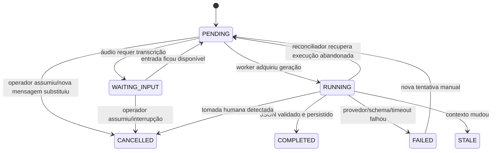

- Chave de deduplicação evita gerações duplicadas por duplo clique/retry. 🟢
- `STALE` preserva o resultado histórico, mas o impede de ser tratado como resumo/sugestão atual. 🟢
- `CHATBOT_REPLY` tem prioridade sobre sugestão, resumo e teste administrativo. 🟢

### Proposta de IA

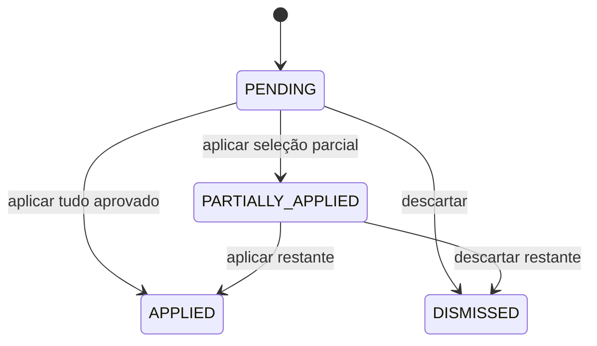

Cada aplicação usa os serviços normais do CRM e registra o usuário decisor; a IA não executa a mutação sozinha. 🟢

## 11. Documento RAG

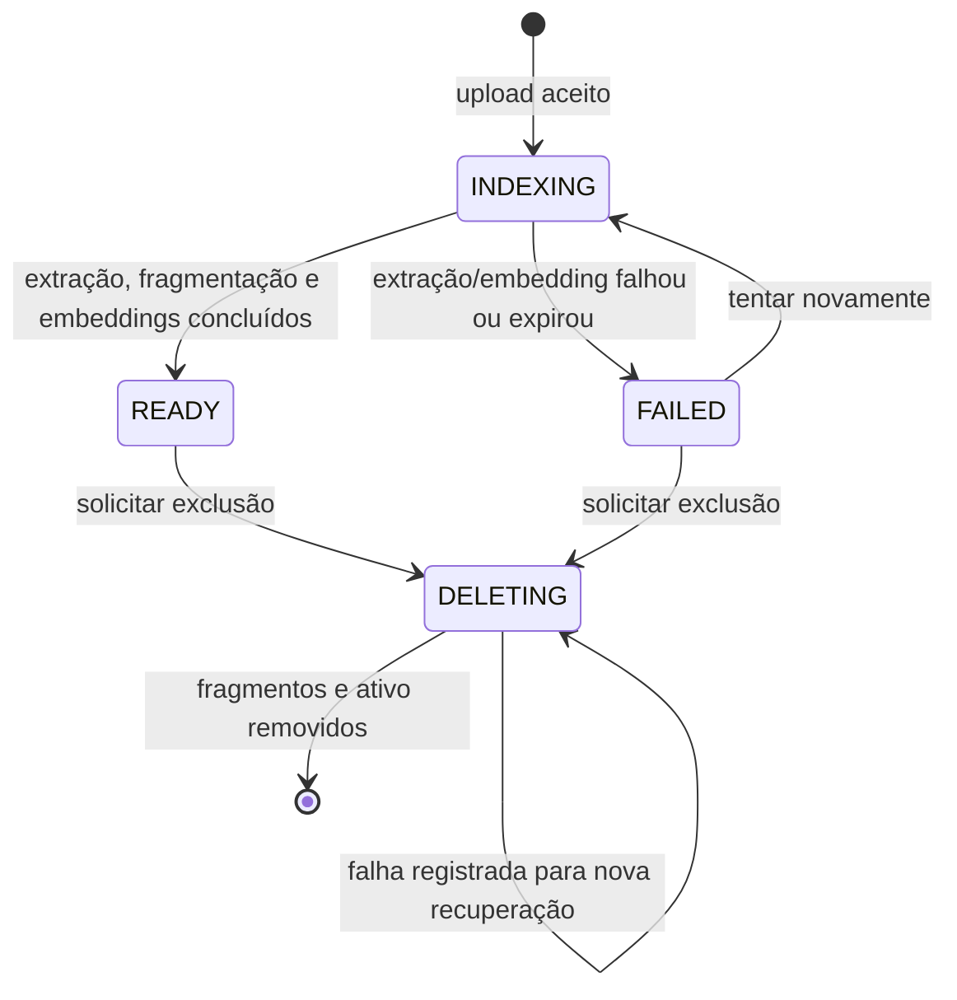

- Apenas `READY` participa da recuperação de contexto. 🟢
- Indexações abandonadas recebem falha após cinco minutos e podem ser reenfileiradas. 🟢
- 🔴 O estado `DELETING` não possui outro estado terminal persistido; sucesso remove o registro, e falha permanece para reconciliação.

## 12. Regras de consistência entre máquinas

1. `Conversation.CLOSED + inbound → Conversation.WAITING`, e não `OPEN`. 🟢
2. `Conversation` assumida por humano → `ChatbotSession.STOPPED` e `CHATBOT_REPLY.CANCELLED`. 🟢
3. Opt-out do contato → destinatários pendentes `OPTED_OUT` e inscrições `STOPPED`. 🟢
4. Resposta antes de follow-up → follow-up/tarefa `CANCELLED`; durante execução → follow-up `INTERRUPTED` e tarefa `COMPLETED`. 🟢
5. Etapa de follow-up `SENT` → próxima etapa `PENDING` recebe `scheduledAt`; última etapa → follow-up/tarefa `COMPLETED`. 🟢
6. Arquivar workflow/chatbot → execuções `ACTIVE/WAITING` tornam-se `STOPPED`. 🟢
7. Nova mensagem ou envio manual relevante → resumos `COMPLETED` tornam-se `STALE`. 🟢
8. Remover responsável ativo → conversa `WAITING`; follow-up preserva último responsável até nova atribuição. 🟢

## 13. Lacunas

- 🔴 Não há máquina formal para estado de mídia, transcrição, webhook externo e notificação; usam timestamps/campos de erro ou estado auxiliar local.
- 🟡 Alguns estados aceitos pelo schema são alcançados por webhooks do provedor e não por transições centralizadas; a ordem real depende da Evolution/Mailgun.
- 🔴 Não há enforcement genérico de transições legais no banco; os serviços e cláusulas condicionais de atualização são a defesa principal.
- 🟡 Não foi encontrada reabertura explícita de tarefas concluídas/canceladas; uma futura funcionalidade deve decidir se cria nova tarefa ou altera a atual.

## 14. Evidências principais

- `packages/database/prisma/schema.prisma`
- `apps/api/src/integrations/evolution.service.ts`
- `apps/api/src/campaigns/campaigns.service.ts`
- `apps/api/src/workflows/workflows.service.ts`
- `apps/api/src/chatbots/chatbots.service.ts`
- `apps/api/src/follow-ups/follow-ups.service.ts`
- `apps/api/src/ai/ai.service.ts`
- `apps/worker/src/inbound.processor.ts`
- `apps/worker/src/outbound.processor.ts`
- `apps/worker/src/campaign.processor.ts`
- `apps/worker/src/workflow.processor.ts`
- `apps/worker/src/chatbot.processor.ts`
- `apps/worker/src/follow-up.processor.ts`
- `apps/worker/src/ai.processor.ts`
- `apps/worker/src/ai-knowledge.processor.ts`
