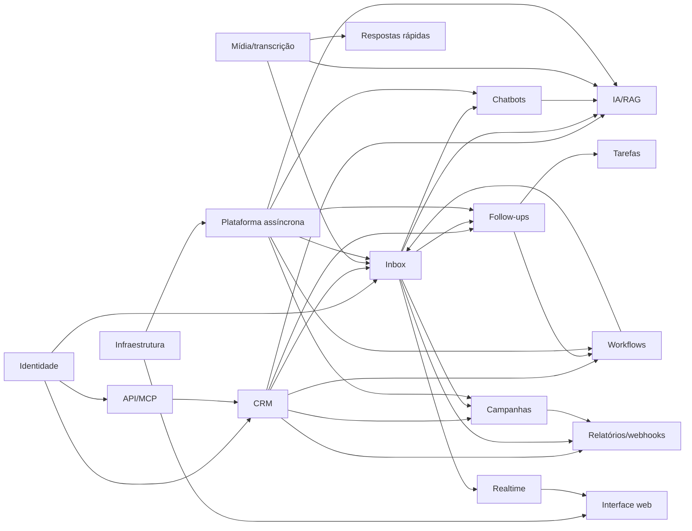

# Spec Impact Matrix — BZS One

> Mapa de impacto técnico e documental em 2026-08-21. “Direto” significa contrato, import ou fluxo confirmado; “indireto” significa comportamento propagado por estado/evento/infraestrutura.

## 1. Matriz por componente

| Componente alterado | Dependências que precisa preservar | Impacto direto provável | Impacto indireto provável | Specs de referência | Testes mínimos |
|---|---|---|---|---|---|
| Identidade e acesso | Prisma, JWT, Argon2, e-mail transacional | todos os controllers, Socket.IO, MCP/API keys, navegação web | auditoria, convites, recuperação e sessão entre abas | `permissions.md`, ADR 003, fluxo identity | auth, users, guard, realtime, web auth |
| CRM comercial | identidade, mídia, contratos, webhooks | dashboard, empresas, contatos, pipeline, tarefas, segmentos | campanhas, Inbox, workflows, follow-up, IA e relatórios | `domain.md`, ERD seção 2, fluxo CRM | crm service/controller, CSV, telefone/CNPJ, páginas CRM |
| WhatsApp/Inbox | CRM, Evolution, mídia, filas, realtime | conversas, mensagens, tickets e ações do composer | chatbot, campanhas, follow-up, IA, notificações e PDF | estados, fluxo Inbox, ADR 004 | evolution API/worker, inbound/outbound, Inbox web |
| Campanhas/e-mail | contatos, instâncias, Gmail/Mailgun, filas | audiência, destinatário, cadência e métricas | aquecimento, Inbox, supressão, relatórios e notificações | domínio 3.4, estados 6, ADR 005 | campaign API/worker, CSV, Gmail, Mailgun webhook, UI |
| Chatbots | Inbox, workflows graph, IA, filas | versões, sessões, blocos e handoff | notificações, transcrição, respostas outbound e contato | estados 8, fluxo chatbot, ADR 008 | chatbot API/worker, graph validation, AI handoff, UI builder |
| Workflows | CRM, Inbox, filas | versões, inscrições, ações CRM/WhatsApp | tarefas, tags, pipeline, assinatura e eventos internos | estados 7, fluxo workflows | workflow API/worker, reentrada, delays, UI builder |
| Follow-ups | Inbox, tarefas, workflows, outbound | agenda, sequência, revisão e cancelamento | e-mail de alerta, assinatura, transferência e realtime | estados 9, ADR 007, fluxo follow-up | follow-up API/worker/outbound/inbound, calendário/modal |
| IA e RAG | Inbox, OpenAI, mídia/transcrição, chatbot | gerações, propostas, configurações e documentos | CRM aprovado, handoff, Socket.IO e retenção | domínio 3.7, estados 10/11, ADR 008 | AI API/worker/client, RAG, stale, UI drawer/settings |
| Mídia/transcrição | S3, permissões, Evolution, Speaches | upload, URL, download e transcrição | Inbox, quick replies, propostas, PDF, IA/RAG | fluxo mídia, ERD seção 3 | media API/storage, transcription API/worker, uploads web |
| Relatórios/webhooks | CRM, Inbox, campanhas, PDF, filas | resumo, PDF, exportação e entregas externas | auditoria, SSRF, escopos e operação | architecture 6/11, fluxo reports | reports, PDF, webhook URL, worker HTTP seguro |
| Respostas rápidas | conversas, mídia, organização | catálogo e composer `/` | variáveis, outbound e storage cleanup | fluxo quick replies | API quick replies, media ownership, Inbox commands |
| Realtime/notificações | sessões, Redis, Socket.IO, Query cache | salas, eventos, contadores e invalidação | todas as telas que aguardam atualização | fluxo realtime, C4 components | gateway, mergeLatestHistory, som, Shell |
| API externa/MCP | auth, contratos, CRM REST | Swagger, ferramentas e idempotência | clientes LLM e auditoria/lastUsedAt | ADR 006, permissions 7 | API key, interceptor, MCP tools/client/smoke |
| Interface web | API contracts, permissões, realtime | rotas, páginas, componentes e acessibilidade | performance percebida e todos os casos de uso | C4 components 3, fluxo web | typecheck, testes web, browser/E2E visual |
| Plataforma assíncrona | Redis, Prisma, clientes externos | registro de workers, retries e reconciliação | todos os efeitos externos e estados operacionais | ADR 002, fluxo async | suítes worker, shutdown, reconciliação, carga |
| Infraestrutura | Docker, redes, env, volumes | disponibilidade de todos os containers | segurança, backup, URLs, capacidade e deploy | C4 containers, architecture 9/11, ADRs 001/004/009 | compose config, health, rebuild, backup/restore smoke |

## 2. Dependências direcionais

## 3. Matriz de artefatos compartilhados

| Artefato | Consumidores principais | Risco da mudança |
|---|---|---|
| `packages/database/prisma/schema.prisma` | API, worker, seed, migrations, testes | quebra transversal e migração obrigatória |
| `packages/contracts/src/index.ts` | API, web, worker, MCP indireto | incompatibilidade de DTO/validação |
| utilitários de telefone/variáveis | CRM, campanhas, workflows, Inbox, quick replies | dedupe ou conteúdo de envio divergente |
| `AuthContext`/permissões | todos os serviços API, realtime | vazamento ou bloqueio de dados |
| `Message` + payload | Inbox, campanhas, follow-up, chatbot, IA, PDF | renderização/status/reply/edit/delete |
| `MediaAsset` | Inbox, perfil, empresa, quick reply, proposta, RAG | ownership, vazamento ou objeto órfão |
| nomes de fila/job | API e worker | trabalho aceito que nunca executa |
| nomes de evento realtime | API, worker e web | UI desatualizada com backend correto |
| variáveis `.env` | Compose, API, worker, MCP, web build | falha de startup ou URL/segredo incorreto |
| regras Caddy/Nginx/Vite | browser, mídia, Socket.IO, Swagger, MCP | 404/502/CORS/host bloqueado |

## 4. Cenários de mudança e raio de impacto

### 4.1 Adicionar campo em contato

1. Prisma + migração.
2. Contratos create/update/list/detail e Swagger.
3. CRM service, importação/exportação, dedupe se aplicável.
4. Forms/lista/drawer web.
5. Variáveis de mensagem, filtros/segmentos e busca.
6. Campanhas, workflows e IA/propostas se o campo for utilizável nesses contextos.
7. MCP schemas/ferramentas.
8. Testes de escopo e serialização.

### 4.2 Adicionar tipo de mensagem WhatsApp

1. Normalização inbound e armazenamento de payload/mídia.
2. Cliente Evolution outbound quando enviável.
3. `Message`/contratos/API de histórico.
4. Renderização, preview, ação, exportação PDF e retry no Inbox.
5. Campanhas/follow-up/quick reply se permitido.
6. IA/resumo e transcrição se houver conteúdo interpretável.
7. Retenção e exclusão de mídia.

### 4.3 Adicionar nó de workflow/chatbot

1. Contrato do grafo e validação estrita.
2. Editor XYFlow, painel de propriedades e serialização.
3. Processador do worker e estado de step.
4. Regras de ciclo/alcance/fronteira assíncrona.
5. Versionamento imutável e compatibilidade de versões antigas.
6. Realtime/log interno/erro e testes de retomada.

### 4.4 Alterar política de permissão

1. Seed/papéis existentes e tela administrativa.
2. Decorators do controller e filtros dos serviços.
3. visibilidade especial do Inbox e Socket.IO.
4. Swagger/API keys/MCP quando o recurso for público.
5. navegação e controles web.
6. testes de acesso direto por ID, organização, equipe e proprietário.

### 4.5 Trocar provedor externo

1. Cliente isolado e configuração/env.
2. payload, ID, estados e erros normalizados.
3. worker/retry/idempotência/reconciliador.
4. webhooks de retorno e assinatura.
5. health/smoke, Docker/rede/egress e documentação operacional.
6. histórico existente e migração de identificadores remotos.

## 5. Rastreabilidade de estado para código

| Máquina | Autoridade de escrita principal | Leitores/efeitos |
|---|---|---|
| usuário/sessão | auth/users API | guard, realtime, web, e-mail |
| oportunidade/tarefa | CRM API | dashboard, pipeline, calendário, follow-up, relatórios |
| conversa/mensagem | Evolution API service + inbound/outbound worker | Inbox, chatbot, workflow, campaign, follow-up, AI, PDF |
| campanha/destinatário | campaigns API + campaign worker | Inbox, relatórios, Mailgun webhook |
| workflow/inscrição | workflows API + workflow worker | CRM, Inbox, follow-up |
| chatbot/sessão | chatbots API + chatbot/AI worker | Inbox, notificações |
| follow-up/etapa | follow-ups API + follow-up/outbound/inbound worker | tarefa, Inbox, e-mail |
| geração/proposta/documento IA | AI API + AI/RAG worker | Inbox/settings, CRM aprovado, realtime |
| webhook delivery | reports API + external webhook worker | sistemas externos e operação |

## 6. Gates recomendados por alcance

| Alcance | Gates mínimos |
|---|---|
| arquivo local sem contrato | typecheck + teste direcionado + diff check |
| módulo API/web/worker | typecheck workspace + suíte do workspace + teste de integração relevante |
| contratos ou Prisma | generate/migrate validation + typecheck/build/test de todos consumidores |
| autenticação/permissão | matriz de papéis, acesso por ID, sessão/CSRF/API key e E2E |
| fila/estado | retry, idempotência, reinício, reconciliador e teste com Redis/PostgreSQL |
| integração externa | simulador + smoke homologado + timeout/retry/segredo |
| infraestrutura | `docker compose config`, build, health e teste de restauração sem remover volumes |

## 7. Lacunas de rastreabilidade

- 🔴 Não existe CI versionado que aplique automaticamente os gates da seção anterior.
- 🔴 Não há cobertura formal requisito → teste; a relação ainda é deduzida por nomes e módulos.
- 🟡 Eventos realtime são strings e não possuem um registro único compartilhado por API/worker/web.
- 🟡 A permissão de relatórios precisa ser especificada por métrica para uma matriz de impacto de segurança totalmente determinística.
- 🟡 Alterações de payload JSON histórico exigem compatibilidade manual porque não há versionamento de schema embutido em todos os registros.
